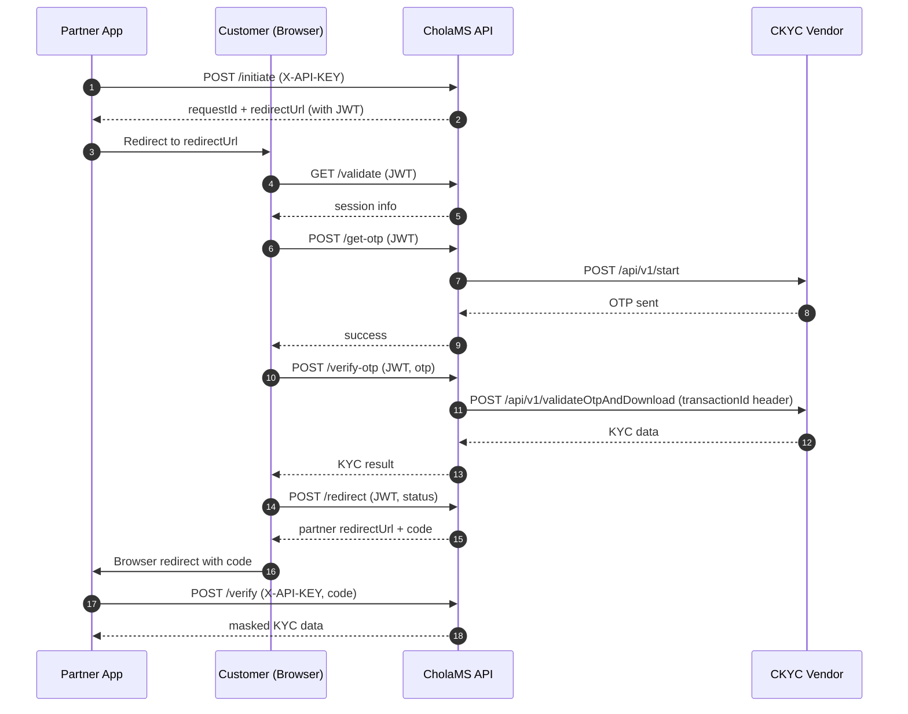
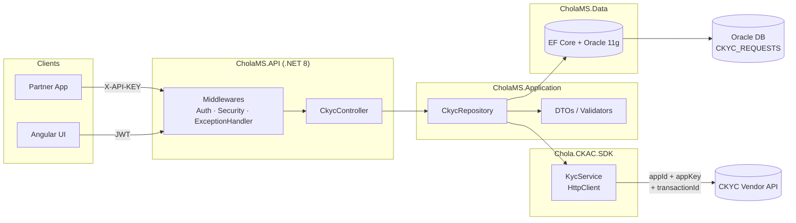

# CholaMS

Enterprise CKYC (Central KYC) verification service built on **.NET 8** + **Angular 18**, integrated with the **Chola CKAC SDK** and backed by **Oracle 11g**.

A partner application starts a KYC request, the customer completes OTP-based verification in the CholaMS UI, and the partner receives a one-time `code` to fetch the masked KYC result.

---

## Table of Contents

- [Overview](#overview)
- [API Details](#api-details)
  - [1. Initiate](#1-initiate)
  - [2. Validate](#2-validate)
  - [3. Get OTP](#3-get-otp)
  - [4. Verify OTP](#4-verify-otp)
  - [5. Redirect](#5-redirect)
  - [6. Verify](#6-verify)
- [Workflow Diagram](#workflow-diagram)
- [Technical Diagram](#technical-diagram)
- [Project Structure](#project-structure)
- [Configuration](#configuration)
- [Getting Started](#getting-started)

---

## Overview

| Layer    | Technology                                  |
| -------- | ------------------------------------------- |
| API      | .NET 8, ASP.NET Core, EF Core 9             |
| Database | Oracle 11g (Oracle.EntityFrameworkCore)     |
| Frontend | Angular 18, TypeScript, Angular Material    |
| Auth     | JWT (HMAC-SHA256) + `X-API-KEY` for partner |
| KYC SDK  | Chola.CKAC.SDK (custom)                     |
| Logging  | Serilog (file + structured)                 |

**Two auth schemes:**

- **Partner endpoints** (`initiate`, `verify`) — use header `X-API-KEY`.
- **User-session endpoints** (`validate`, `get-otp`, `verify-otp`, `redirect`) — use JWT issued at `initiate`. JWT carries `requestId` and is valid for 10 minutes.

---

## API Details

Base path: `/api/v1/ckyc`

### 1. Initiate

**`POST /initiate`** — Partner kicks off a KYC session.

| Auth         | `X-API-KEY` header                                             |
| ------------ | -------------------------------------------------------------- |
| Request body | `clientId`, `transactionId`, `redirectUrl`, optional `payload` |
| Returns      | `requestId`, `redirectUrl` (CholaMS UI + JWT)                  |

```json
{
  "clientId": "CHOLA_CLIENT_01",
  "transactionId": "TXN-TEST-001",
  "redirectUrl": "http://localhost:4200/callback",
  "payload": { "firstName": "Rahul", "mobile": "9876543210" }
}
```

---

### 2. Validate

**`GET /validate`** — UI calls this on landing to confirm the JWT and load the session.

| Auth    | `Authorization: Bearer <JWT>`                                             |
| ------- | ------------------------------------------------------------------------- |
| Returns | `requestId`, `transactionId`, `status`, optional `payload`, `redirectUrl` |

---

### 3. Get OTP

**`POST /get-otp`** — Triggers CKYC vendor to send OTP to the customer's mobile.

| Auth         | `Authorization: Bearer <JWT>`     |
| ------------ | --------------------------------- |
| Request body | `idNo`, `idType`, `mobileNo`      |
| Effect       | Calls vendor `POST /api/v1/start` |

---

### 4. Verify OTP

**`POST /verify-otp`** — Validates the OTP and downloads CKYC data.

| Auth         | `Authorization: Bearer <JWT>`                                                                      |
| ------------ | -------------------------------------------------------------------------------------------------- |
| Request body | `otp`, `requestId`                                                                                 |
| Effect       | Calls vendor `POST /api/v1/validateOtpAndDownload` with the original `transactionId` in the header |

---

### 5. Redirect

**`POST /redirect`** — UI tells the API to issue a one-time `code` and build the partner redirect URL.

| Auth         | `Authorization: Bearer <JWT>`                    |
| ------------ | ------------------------------------------------ |
| Request body | `kycStatus`, optional `errorCode`/`errorMessage` |
| Returns      | `redirectUrl` containing `code=...`              |

The code is valid for 5 minutes, single-use.

---

### 6. Verify

**`POST /verify`** — Partner exchanges the `code` for masked KYC result.

| Auth         | `X-API-KEY` header                                                                   |
| ------------ | ------------------------------------------------------------------------------------ |
| Request body | `clientId`, `transactionId`, `code`                                                  |
| Returns      | `requestId`, `transactionId`, `kycStatus`, masked `kycData` (`pan`, `aadhaarMasked`) |

---

## Workflow Diagram



---

## Technical Diagram



---

## Project Structure

```
CholaMS/
├── api/
│   ├── CholaMS.API/            # Controllers + Middlewares + Program.cs
│   ├── CholaMS.Application/    # DTOs, Repositories, Mappings, Helpers
│   ├── CholaMS.Data/           # EF Core + Oracle DbContext
│   ├── CholaMS.KYC/            # Chola.CKAC.SDK (vendor integration)
│   └── CholaMS.Shared/         # Cross-cutting extensions
├── app/CholaMSUI/              # Angular 18 SPA
├── tests/                      # xUnit tests + SDK validation runner
├── db/DDL/                     # CKYC table scripts
├── scripts/                    # install / start / publish / test-apis
├── build/                      # Dockerfile + Jenkinsfile
└── CholaMS.sln
```

---

## Configuration

`appsettings.json` (override per environment in `appsettings.Development.json` / `appsettings.Production.json`):

```json
{
  "Jwt": {
    "Issuer": "https://connectedprogrammer.com",
    "Audience": "https://connectedprogrammer.com",
    "Key": "<symmetric-key>"
  },
  "KycSettings": {
    "BaseUrl": "http://<ckyc-vendor-host>",
    "AppId": "TEST_APP_01",
    "AppKey": "12345-abcdef"
  },
  "CkycSettings": {
    "ApiKey": "CKYC-API-KEY-CHANGE-IN-PRODUCTION",
    "AllowedClientIds": ["CHOLA_CLIENT_01"],
    "AllowedRedirectUrls": ["https://chola-prutech.com"],
    "CkycAppBaseUrl": "https://ckyc-app.com",
    "TokenExpiryMinutes": 10,
    "RequestExpiryMinutes": 10,
    "CodeExpiryMinutes": 5
  }
}
```

| Group          | Purpose                                                              |
| -------------- | -------------------------------------------------------------------- |
| `Jwt`          | Signs/validates session tokens issued by `/initiate`                 |
| `KycSettings`  | **Outbound** credentials — CholaMS → CKYC vendor (`appId`, `appKey`) |
| `CkycSettings` | **Inbound** auth + whitelists for partner calls into CholaMS         |

---

## Getting Started

```powershell
# 1. Install dependencies
.\scripts\install.ps1

# 2. Build solution
dotnet build CholaMS.sln

# 3. Run API + UI
.\scripts\start.ps1

# 4. Run end-to-end API smoke tests
.\scripts\test-apis.ps1
```

Default URLs:

- API: `http://localhost:5000` (or as configured in `Properties/launchSettings.json`)
- UI: `http://localhost:4200`
- Swagger: `http://localhost:5000/swagger`
- Health: `GET /api/v1/health`
