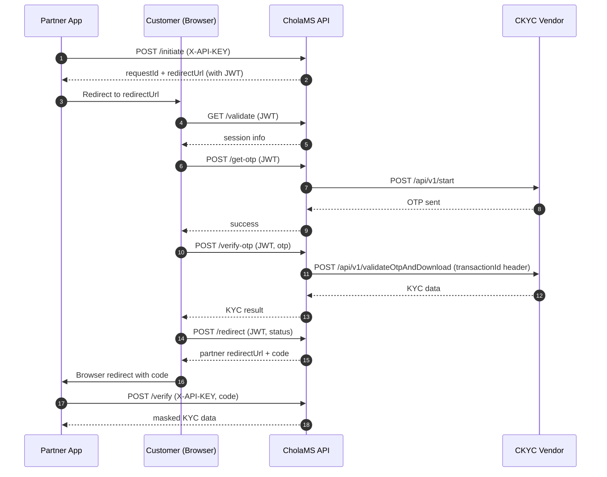
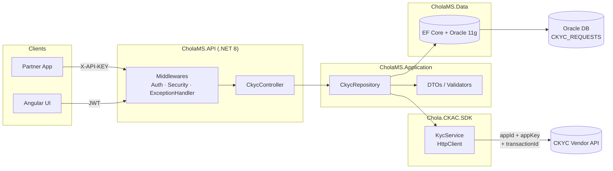

# CholaMS

Enterprise CKYC (Central KYC) verification service built on **.NET 8** + **Angular 18**, integrated with the **Chola CKAC SDK** and backed by **Oracle 11g**.

A partner application starts a KYC request, the customer completes OTP-based verification in the CholaMS UI, and the partner receives a one-time `code` to fetch the masked KYC result.

---

## Table of Contents

- [Overview](#overview)
- [API Details](#api-details)
  - [1. Initiate](#1-initiate)
  - [2. Validate](#2-validate)
  - [3. Get OTP](#3-get-otp)
  - [4. Verify OTP](#4-verify-otp)
  - [5. Redirect](#5-redirect)
  - [6. Verify](#6-verify)
- [Workflow Diagram](#workflow-diagram)
- [Technical Diagram](#technical-diagram)
- [Project Structure](#project-structure)
- [Configuration](#configuration)
- [Getting Started](#getting-started)

---

## Overview

| Layer    | Technology                                  |
| -------- | ------------------------------------------- |
| API      | .NET 8, ASP.NET Core, EF Core 9             |
| Database | Oracle 11g (Oracle.EntityFrameworkCore)     |
| Frontend | Angular 18, TypeScript, Angular Material    |
| Auth     | JWT (HMAC-SHA256) + `X-API-KEY` for partner |
| KYC SDK  | Chola.CKAC.SDK (custom)                     |
| Logging  | Serilog (file + structured)                 |

**Two auth schemes:**

- **Partner endpoints** (`initiate`, `verify`) — use header `X-API-KEY`.
- **User-session endpoints** (`validate`, `get-otp`, `verify-otp`, `redirect`) — use JWT issued at `initiate`. JWT carries `requestId` and is valid for 10 minutes.

---

## API Details

Base path: `/api/v1/ckyc`

All responses follow a common envelope:

```json
{
  "status": "success | failure",
  "statusCode": "200 | 400 | 500",
  "message": "...",
  "result": { ... } | null,
  "error": { "code": "...", "message": "..." } | null
}
```

---

### 1. Initiate

**`POST /initiate`** — Partner kicks off a KYC session.

**Auth:** `X-API-KEY: <CkycSettings:ApiKey>`

**Request body:**

| Field           | Type   | Required | Notes                                                       |
| --------------- | ------ | -------- | ----------------------------------------------------------- |
| `clientId`      | string | yes      | Must be in `CkycSettings:AllowedClientIds` whitelist        |
| `transactionId` | string | yes      | Any partner-supplied correlation ID                         |
| `redirectUrl`   | string | yes      | Must start with one of `CkycSettings:AllowedRedirectUrls`   |
| `payload`       | object | no       | `firstName`, `lastName`, `mobile`, `email`, `dob` (strings) |

**Sample request:**

```json
{
  "clientId": "CHOLA_CLIENT_01",
  "transactionId": "TXN-TEST-001",
  "redirectUrl": "http://localhost:4200/callback",
  "payload": {
    "firstName": "Rahul",
    "lastName": "Sharma",
    "mobile": "9876543210",
    "email": "rahul@example.com",
    "dob": "1990-05-15"
  }
}
```

**Sample success (200):**

```json
{
  "status": "success",
  "statusCode": "200",
  "message": "Operation completed successfully.",
  "result": {
    "requestId": "a1b2c3d4-e5f6-7890-abcd-ef1234567890",
    "redirectUrl": "https://ckyc-app.com/start?token=<JWT>"
  },
  "error": null
}
```

**Error codes:** `INVALID_API_KEY`, `INVALID_CLIENT`, `INVALID_REDIRECT_URL`

---

### 2. Validate

**`GET /validate`** — Angular UI calls this on landing to confirm the JWT and load the session. Also flips the status from `INITIATED` → `IN_PROGRESS` on first call.

**Auth:** `Authorization: Bearer <JWT>` (issued in step 1)

**Request:** no body. `requestId` is read from the JWT.

**Sample success (200):**

```json
{
  "status": "success",
  "statusCode": "200",
  "message": "Operation completed successfully.",
  "result": {
    "requestId": "a1b2c3d4-e5f6-7890-abcd-ef1234567890",
    "transactionId": "TXN-TEST-001",
    "status": "IN_PROGRESS",
    "redirectUrl": "http://localhost:4200/callback",
    "payload": { "firstName": "Rahul", "mobile": "9876543210" }
  },
  "error": null
}
```

**Error codes:** `INVALID_TOKEN`, `NOT_FOUND`, `EXPIRED`, `ALREADY_PROCESSED`

---

### 3. Get OTP

**`POST /get-otp`** — Requests CKYC vendor to send OTP to the customer's mobile.

**Auth:** `Authorization: Bearer <JWT>`

**Request body:**

| Field      | Type   | Required | Notes                                      |
| ---------- | ------ | -------- | ------------------------------------------ |
| `idNo`     | string | yes      | CKYC reference number / identifier         |
| `idType`   | string | yes      | Identifier type (e.g. `C` for CKYC)        |
| `mobileNo` | string | yes      | 10-digit Indian mobile (`StringLength=10`) |

**Sample request:**

```json
{
  "idNo": "ABCDE1234F",
  "idType": "C",
  "mobileNo": "9876543210"
}
```

**Effect:** Calls vendor `POST /api/v1/start` with headers `appId`, `appKey`.

**Sample success (200):**

```json
{
  "status": "success",
  "statusCode": "200",
  "message": "Operation completed successfully.",
  "result": {
    "status": "success",
    "statusCode": "200",
    "result": { "message": "OTP sent successfully", "requestId": "29478072" },
    "error": null
  },
  "error": null
}
```

**Error codes:** `NOT_FOUND`, `EXPIRED`, `CKYC_ERROR`

---

### 4. Verify OTP

**`POST /verify-otp`** — Validates the OTP and downloads CKYC data from the vendor.

**Auth:** `Authorization: Bearer <JWT>`

**Request body:**

| Field       | Type   | Required | Notes                                  |
| ----------- | ------ | -------- | -------------------------------------- |
| `otp`       | string | yes      | OTP received on customer mobile        |
| `requestId` | string | yes      | The vendor `requestId` from `/get-otp` |

**Sample request:**

```json
{
  "otp": "123456",
  "requestId": "29478072"
}
```

**Effect:** Calls vendor `POST /api/v1/validateOtpAndDownload` with headers `transactionId` (from the stored CKYC request), `appId`, `appKey`.

**Sample success (200):**

```json
{
  "status": "success",
  "statusCode": "200",
  "message": "Operation completed successfully.",
  "result": {
    "status": "success",
    "statusCode": "200",
    "result": {
      "ckycRefNo": 12345678901234,
      "downloadCount": 1,
      "residentialStatus": 1,
      "relatedPersonDetails": []
    },
    "error": null
  },
  "error": null
}
```

**Error codes:** `NOT_FOUND`, `EXPIRED`, `CKYC_ERROR`

---

### 5. Redirect

**`POST /redirect`** — UI tells the API the outcome of the KYC flow. The API issues a one-time `code` (5-min, single-use) and builds the partner redirect URL.

**Auth:** `Authorization: Bearer <JWT>`

**Request body:**

| Field          | Type   | Required | Notes                                                                |
| -------------- | ------ | -------- | -------------------------------------------------------------------- |
| `kycStatus`    | enum   | yes      | `COMPLETED`, `VERIFIED`, `REJECTED`, `FAILED` (serialized as string) |
| `errorCode`    | string | no       | Used when `kycStatus` is not success                                 |
| `errorMessage` | string | no       | Used when `kycStatus` is not success                                 |

**Sample request (success):**

```json
{ "kycStatus": "COMPLETED" }
```

**Sample request (failure):**

```json
{
  "kycStatus": "REJECTED",
  "errorCode": "KYC_REJECTED",
  "errorMessage": "Customer details did not match"
}
```

**Sample success response:**

```json
{
  "status": "success",
  "statusCode": "200",
  "message": "Operation completed successfully.",
  "result": {
    "redirectUrl": "http://localhost:4200/callback?code=<one-time-code>&status=completed&transactionId=TXN-TEST-001"
  },
  "error": null
}
```

**Error codes:** `NOT_FOUND`, `NO_REDIRECT_URL`

---

### 6. Verify

**`POST /verify`** — Partner exchanges the `code` for the masked KYC result. Code is consumed on success.

**Auth:** `X-API-KEY: <CkycSettings:ApiKey>`

**Request body:**

| Field           | Type   | Required | Notes                                           |
| --------------- | ------ | -------- | ----------------------------------------------- |
| `clientId`      | string | yes      | Must match the one sent in `/initiate`          |
| `transactionId` | string | yes      | Must match the one sent in `/initiate`          |
| `code`          | string | yes      | One-time code from `/redirect` (5-min, one use) |

**Sample request:**

```json
{
  "clientId": "CHOLA_CLIENT_01",
  "transactionId": "TXN-TEST-001",
  "code": "k3l9Hn2pQrS7tUvWxYz0AbCdEfGh1Ij2"
}
```

**Sample success (200):**

```json
{
  "status": "success",
  "statusCode": "200",
  "message": "Operation completed successfully.",
  "result": {
    "requestId": "a1b2c3d4-e5f6-7890-abcd-ef1234567890",
    "transactionId": "TXN-TEST-001",
    "kycStatus": "COMPLETED",
    "kycData": {
      "pan": "XXXXXX234F",
      "aadhaarMasked": "XXXX-XXXX-5678"
    }
  },
  "error": null
}
```

**Error codes:** `INVALID_API_KEY`, `INVALID_CODE`, `CODE_USED`, `CODE_EXPIRED`, `MISMATCH`, `NOT_FOUND`

---

## Workflow Diagram



---

## Technical Diagram



---

## Project Structure

```
CholaMS/
├── api/
│   ├── CholaMS.API/            # Controllers + Middlewares + Program.cs
│   ├── CholaMS.Application/    # DTOs, Repositories, Mappings, Helpers
│   ├── CholaMS.Data/           # EF Core + Oracle DbContext
│   ├── CholaMS.KYC/            # Chola.CKAC.SDK (vendor integration)
│   └── CholaMS.Shared/         # Cross-cutting extensions
├── app/CholaMSUI/              # Angular 18 SPA
├── tests/                      # xUnit tests + SDK validation runner
├── db/DDL/                     # CKYC table scripts
├── scripts/                    # install / start / publish / test-apis
├── build/                      # Dockerfile + Jenkinsfile
└── CholaMS.sln
```

---

## Configuration

`appsettings.json` (override per environment in `appsettings.Development.json` / `appsettings.Production.json`):

```json
{
  "Jwt": {
    "Issuer": "https://connectedprogrammer.com",
    "Audience": "https://connectedprogrammer.com",
    "Key": "<symmetric-key>"
  },
  "KycSettings": {
    "BaseUrl": "http://<ckyc-vendor-host>",
    "AppId": "TEST_APP_01",
    "AppKey": "12345-abcdef"
  },
  "CkycSettings": {
    "ApiKey": "CKYC-API-KEY-CHANGE-IN-PRODUCTION",
    "AllowedClientIds": ["CHOLA_CLIENT_01"],
    "AllowedRedirectUrls": ["https://chola-prutech.com"],
    "CkycAppBaseUrl": "https://ckyc-app.com",
    "TokenExpiryMinutes": 10,
    "RequestExpiryMinutes": 10,
    "CodeExpiryMinutes": 5
  }
}
```

| Group          | Purpose                                                              |
| -------------- | -------------------------------------------------------------------- |
| `Jwt`          | Signs/validates session tokens issued by `/initiate`                 |
| `KycSettings`  | **Outbound** credentials — CholaMS → CKYC vendor (`appId`, `appKey`) |
| `CkycSettings` | **Inbound** auth + whitelists for partner calls into CholaMS         |

---

## Getting Started

```powershell
# 1. Install dependencies
.\scripts\install.ps1

# 2. Build solution
dotnet build CholaMS.sln

# 3. Run API + UI
.\scripts\start.ps1

# 4. Run end-to-end API smoke tests
.\scripts\test-apis.ps1
```

Default URLs:

- API: `http://localhost:5000` (or as configured in `Properties/launchSettings.json`)
- UI: `http://localhost:4200`
- Swagger: `http://localhost:5000/swagger`
- Health: `GET /api/v1/health`
