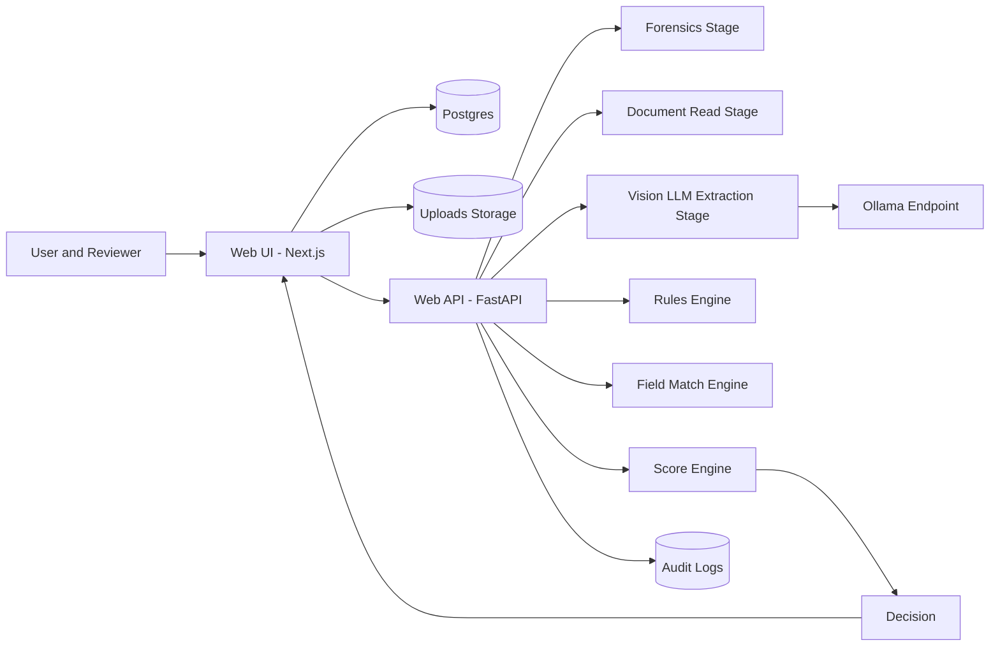
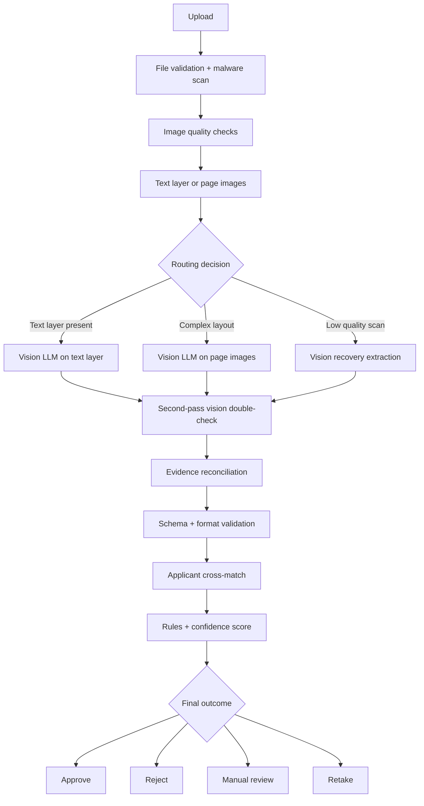
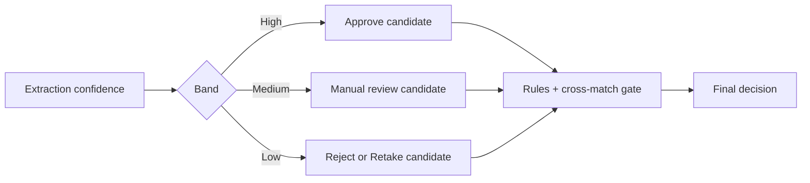
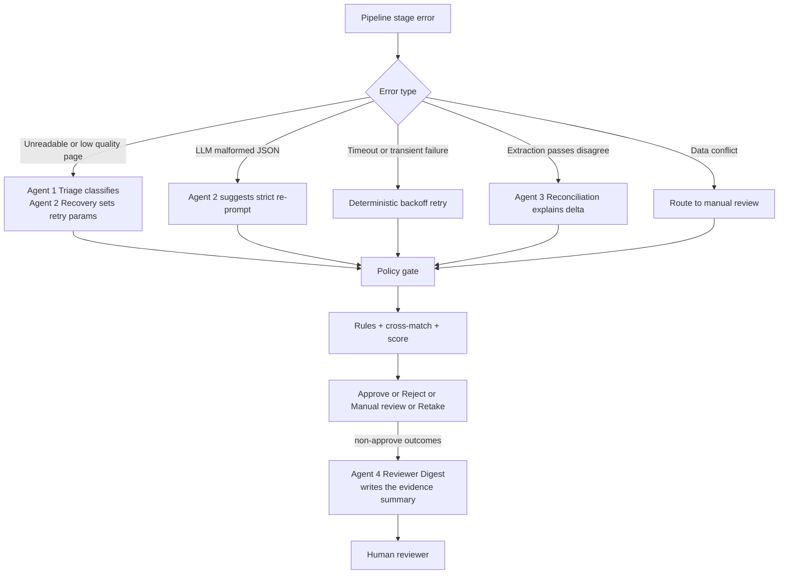

# Document Intelligence Platform - Short Presentation Note

## 1. Goal

Build a reliable document verification flow with:

- Strong extraction quality
- Low hallucination risk
- Clear confidence-based outcomes

## 2. Current pipeline (implemented)

Flow:
Upload -> Forensics -> Document read -> Vision LLM extraction -> Rules -> Cross-match -> Score -> Outcome



## 3. Future scope pipeline (deeper vision checks)

Flow:
Upload -> Validation and malware scan -> Image quality check -> Document read -> Routing -> Vision LLM extraction -> Second-pass check -> Reconciliation -> Validation -> Outcome



## 4. Why the vision model replaces OCR

- There is no OCR engine: the vision model reads the page image directly.
- Layout, stamps, seals, tables and handwriting stay available to the model —
  none of that survives a text-recognition step.
- Digital containers (PDF text layer, DOCX, XLSX) skip rendering entirely and
  pass their existing text straight to the model.

## 5. Confidence to outcome mapping



## 6. Recommended deployment direction

- Keep deterministic rules as final decision authority.
- Use Vision LLM as verifier/double-check, not as sole decision maker.
- Add queue-based scaling for high document volume.

## 7. Workflow with agent (error handling plan)

Yes, we can onboard agents for error handling, but only as an **assistant layer**. Nothing in this section is implemented yet — there is no agent code in `Web-api/app/` today.

### 7.1 How many agents, and what each one owns

Four agents, each with one narrow job. They are deliberately separate so a failure or a bad suggestion in one cannot contaminate the others, and so the two cheap ones can ship without the expensive ones.

| # | Agent               | Fires when                                                              | Responsibility                                                                                                                         | Must never                                                    | Priority                                            |
| - | ------------------- | ----------------------------------------------------------------------- | -------------------------------------------------------------------------------------------------------------------------------------- | ------------------------------------------------------------- | --------------------------------------------------- |
| 1 | **Triage**          | Any pipeline stage raises                                               | Classify the failure (unreadable, malformed JSON, timeout, data conflict) and name a remediation: retry, re-read, manual review, retake | Decide the case outcome; retry a permanent failure             | **Low** — a lookup table already does this (see 7.3) |
| 2 | **Recovery**        | Triage says the input is recoverable                                    | Pick concrete re-processing parameters: re-render at higher DPI, read more pages, strict re-prompt, switch text-layer → page-image path | Change extracted values; loop more than the configured attempts | **Medium**                                          |
| 3 | **Reconciliation**  | Two extraction passes disagree (future-scope second-pass check, §3)     | Explain *which* field differs, *how* and which pass is better supported by the evidence                                                | Pick a winner silently — it reports, the policy gate decides   | **Medium**                                          |
| 4 | **Reviewer Digest** | Any case lands in `MANUAL_REVIEW` / `DATA_MISMATCH` / `RETAKE_REQUIRED` | Turn rule weights, match scores and forensics signals into a short reviewer-readable narrative with evidence links and page references  | Recommend approve/reject; introduce facts not in the evidence  | **High** — clearest value, zero decision risk       |

Shared responsibilities for all four: emit a structured suggestion object (never free prose into the decision path), log input/output against the `request_id`, and carry a confidence the policy gate can threshold on.

### 7.2 Guardrails

- Final decision remains with deterministic rules + policy thresholds.
- Every agent action is logged with input/output and request ID.
- An agent can *suggest* an override; a human reviewer or the policy engine must confirm it.
- Agents receive **structured pipeline output only** — never raw applicant PII beyond what the reviewer already sees.
- Every agent call is bounded: one attempt, hard timeout, and a deterministic fallback if it fails or returns nothing. An agent outage must degrade the experience, not the pipeline.

### 7.3 Where an agent does *not* belong

The routing decision itself is already deterministic and specified in §11.9 of [architecture-and-operations.md](architecture-and-operations.md) — transient → backoff retry, permanent → fail fast, ambiguous → manual review, unusable → retake. For that mapping, a lookup table beats an LLM on latency, cost and reproducibility, and it is auditable. Agent #1 is therefore listed for completeness, not as a recommendation; build #4 first.



## 8. Concurrency and parallel processing best practices

- Use bounded concurrency, not unbounded fan-out.
- Keep UI parallel workers aligned with API/LLM concurrency caps.
- Split workloads by type: fast lane (digital text docs) and heavy lane (scanned/image docs).
- Add queue + retry + dead-letter handling for burst traffic.
- Use idempotency keys to prevent duplicate processing.
- Keep strict timeouts per stage and circuit-breaker on repeated downstream failures.
- Emit per-stage metrics (latency, error rate, queue wait, retry count).
- Preserve ordering only where required; process documents independently when possible.

Suggested control model:

- Ingress API accepts requests quickly.
- Queue controls backpressure.
- Worker pool sizes are tuned per stage.
- LLM calls use semaphore limits and cache for repeated content.

### 8.1 Concurrency configuration (short, numbered)

1. UI dispatch parallelism: `min(total_docs, VERIFY_PARALLEL)`.
2. `forensics` stage parallelism: `min(total_docs, VERIFY_PARALLEL, WEB_API_WORKERS)`.
3. `read` stage parallelism: `min(total_docs, VERIFY_PARALLEL, WEB_API_WORKERS)`.
4. `llm` admission at API: `min(total_docs, VERIFY_PARALLEL, WEB_API_WORKERS * OLLAMA_MAX_CONCURRENCY)`.
5. `llm` generation at Ollama: `min(total_docs, VERIFY_PARALLEL, OLLAMA_NUM_PARALLEL)`.
6. `rules` / `match` / `score` stage parallelism: `min(total_docs, VERIFY_PARALLEL, WEB_API_WORKERS)`.
7. Baseline setting: keep `VERIFY_PARALLEL = OLLAMA_MAX_CONCURRENCY = OLLAMA_NUM_PARALLEL` to reduce queueing and tail latency.

## 9. Confidence and decision governance

### 9.1 Do not trust LLM confidence alone

Final confidence should be a combined score from multiple checks:

```text
page quality score
+ multi-pass vision agreement
+ evidence presence
+ format validation
+ applicant cross-match
+ document quality
```

LLM self-reported confidence should be a weak input only.

### 9.2 Keep final decisions outside the LLM

LLM can extract fields and summarize evidence, but it must not directly decide:

```text
APPROVE
REJECT
MANUAL_REVIEW
RETAKE
```

Final outcomes must come from deterministic rules, cross-match logic, policy thresholds, and human review workflow.
