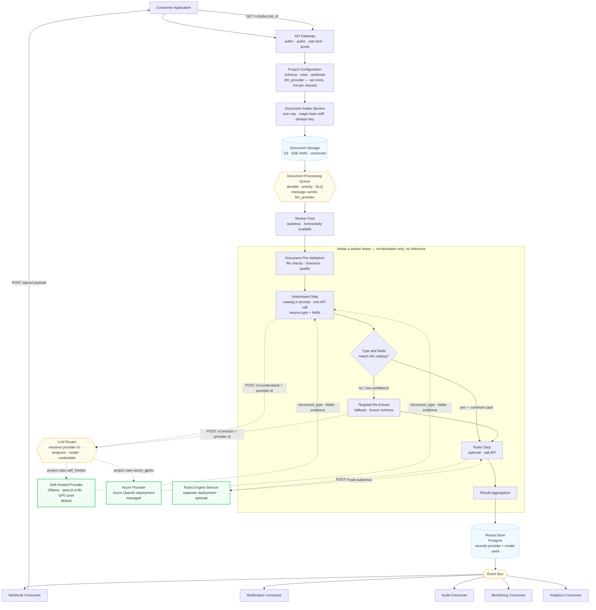

# Document Intelligence Platform — Architecture

> **Status: design target, not shipped.** The API today executes the pipeline
> **synchronously** inside the request and returns the decision on the same
> connection. The queue, event bus and worker pool below do not exist in the
> repository yet.

## Architecture flow



**What each box does**

- **Consumer Application** — the calling system. Submits a document, then receives a webhook or polls for the result.
- **API Gateway** — authenticates the caller, authorises the project, applies rate limits and quota.
- **Project Configuration** — resolves the project's field schema, rules, webhook target **and `llm_provider`**. The provider is chosen once when the project is set up; every later request inherits it.
- **Document Intake Service** — enforces the size cap, sniffs magic bytes to confirm the real file type, and computes the dedupe key.
- **Document Storage** — writes the file to S3 (encrypted, versioned). The queue message carries the URI, never the bytes.
- **Document Processing Queue** — durable hand-off. The message carries the resolved `llm_provider`, so the worker never re-reads config.
- **Worker Pool** — stateless consumers. Any worker can take any job; killing one costs only a redelivery.
- **Document Pre-Validation** — local CPU work: file checks, forensics (tamper signals) and image quality.
- **Understand Step** — the only LLM call in the normal path. Sends the page image once with the type catalog in the prompt; the model returns the document type _and_ that type's fields with per-field evidence.
- **Type and fields match?** — server-side check, no LLM. Is the returned type in the catalog, do the field names match its schema, is confidence above threshold?
- **Targeted Re-Extract** — fallback only. Re-asks for a known schema when the check fails. Most documents never reach it.
- **Rules Step** — optional. Sends the structured fields to the rules engine; skipped if the project has no rules.
- **Result Aggregation** — merges validation, extraction and rule outcomes into one decision.
- **LLM Router** — maps the provider id to an endpoint, model and credentials held server-side. Callers pass an id, never a URL or key.
- **Self-Hosted Provider** — the default. Ollama on the GPU pool.
- **Azure Provider** — Azure OpenAI deployment, for projects that opt into a managed model.
- **Rules Engine Service** — separately deployed policy evaluation. Receives structured data only, never the document.
- **Result Store** — Postgres. UPSERT keyed on `job_id`, so redelivery is safe. Records which provider and model produced the result.
- **Event Bus** — fans the terminal event out to consumers: webhook, notification, audit, monitoring, analytics.

**Model selection is a setting, not a step**

A project picks its provider once — self-hosted by default, Azure with one switch. Intake resolves it, stamps it on the queue message, and the worker just uses what it was handed. Nothing is chosen per upload and the consumer application sends no model information at all.

Providers are defined server-side and referenced by id. A caller supplying an endpoint URL or an API key would be both an SSRF hole and a credential leak, so the request carries `llm_provider: "azure_gpt4o"` and nothing more. Because provider and model change the extracted values, both are written to the result row — otherwise two runs of the same document can disagree with no way to explain why.

**Example — one driver's licence photo**

1. **Understand Step.** The image goes up once, with the catalog in the text prompt.

   ```json
   POST /v1/understand  →  {
     "document_type": "primary_document__drivers_license",
     "type_confidence": 0.94,
     "fields": {
       "full_name":      { "value": "PRIYA NATARAJAN", "confidence": 0.97, "evidence": "line 2 of the ID block" },
       "date_of_birth":  { "value": "1991-04-18",      "confidence": 0.95, "evidence": "DOB field" },
       "license_number": { "value": "N4820193",        "confidence": 0.91, "evidence": "top-right" },
       "issuing_state":  { "value": "NJ",              "confidence": 0.99, "evidence": "header" },
       "expiry_date":    { "value": "2029-04-18",      "confidence": 0.93, "evidence": "EXP field" }
     }
   }
   ```

2. **Validate.** `primary_document__drivers_license` is in the catalog, its schema is `full_name · date_of_birth · license_number · issuing_state · expiry_date`, all five came back, confidence clears the threshold. Done — one LLM call total.

3. **Targeted Re-Extract (skipped here).** Had the model returned `primary_document__social_security_card` with driver's-licence fields, or `type_confidence` of 0.41, the worker would re-ask with that type's real schema — `full_name · ssn_last4` — and only then continue.

The **queue is the asynchronous boundary**. Everything above it runs inside the client's HTTP request and must stay in the low hundreds of milliseconds. Everything below it runs on worker time and may take as long as it takes.

The worker **owns no inference**. It leases a message, fetches bytes, builds prompts and sequences the stages; understanding the document and evaluating rules are HTTP calls to separately deployed services. That keeps the worker CPU-light and lets the GPU pool scale on its own axis — adding worker replicas raises throughput only until the LLM service saturates.

## Technology

- **API** — FastAPI + Uvicorn (Python 3.11)
- **Web UI** — Next.js (App Router) + Prisma
- **Database** — PostgreSQL
- **Object storage** — S3 (MinIO for self-hosted / offline installs)
- **Queue** — RabbitMQ, quorum queues with a DLQ
- **LLM serving** — Ollama, fronted by an internal HTTP service
- **Document rendering** — pypdfium2, python-docx, openpyxl, Pillow

## Models

No OCR engine. The vision model reads the page image directly, so the extraction model must be vision-capable.

| Model                       | Size   | Min RAM | Use for                                    |
| --------------------------- | ------ | ------- | ------------------------------------------ |
| **`qwen3-vl:8b`** (default) | 6.1 GB | 16 GB   | Classification and extraction — start here |
| `blaifa/InternVL3_5:8b`     | 5.5 GB | 16 GB   | Dense scans, multi-column layouts, tables  |
| `minicpm-v:8b`              | 5.5 GB | 12 GB   | CPU-only or tight RAM; fastest of the set  |
| `llama3.2-vision:11b`       | 7.8 GB | 24 GB   | Heaviest reasoning; needs a GPU            |

- Models swap at request time over Ollama's HTTP API — no rebuild.
- `qwen3-vl:8b` needs Ollama 0.12 or newer.
- A GPU matters more than the model choice (~10-15x on a T4).
