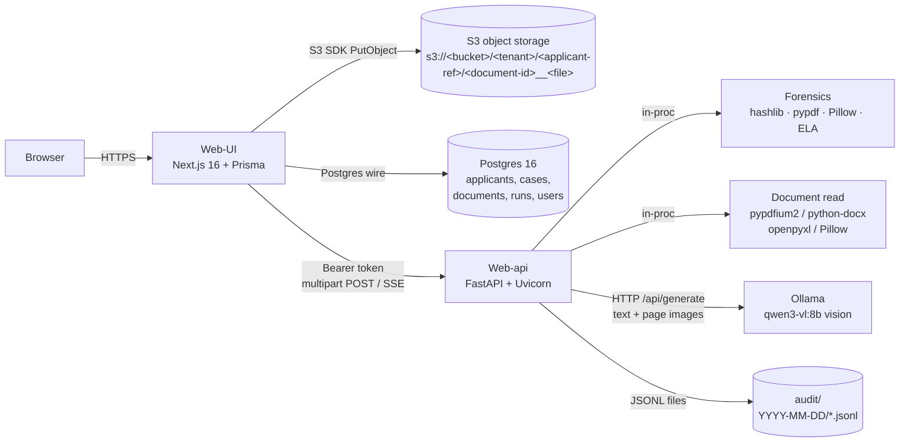
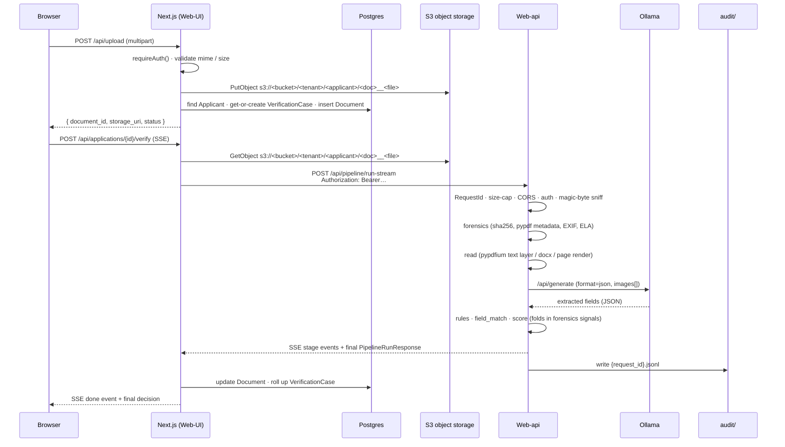
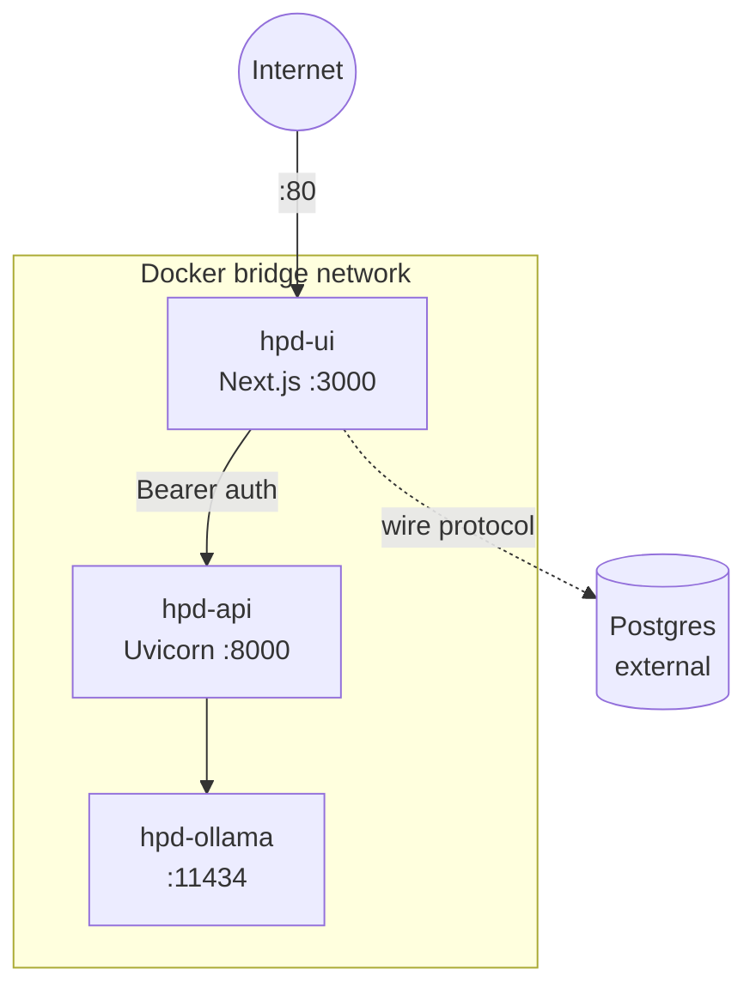
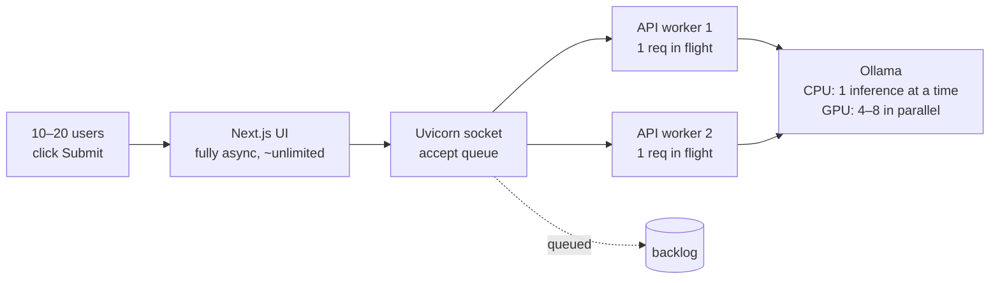
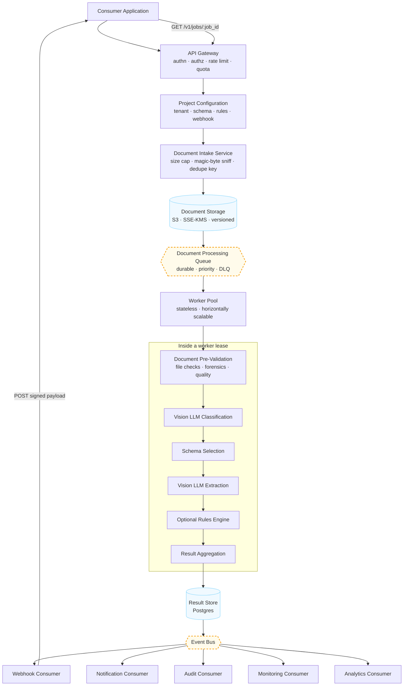
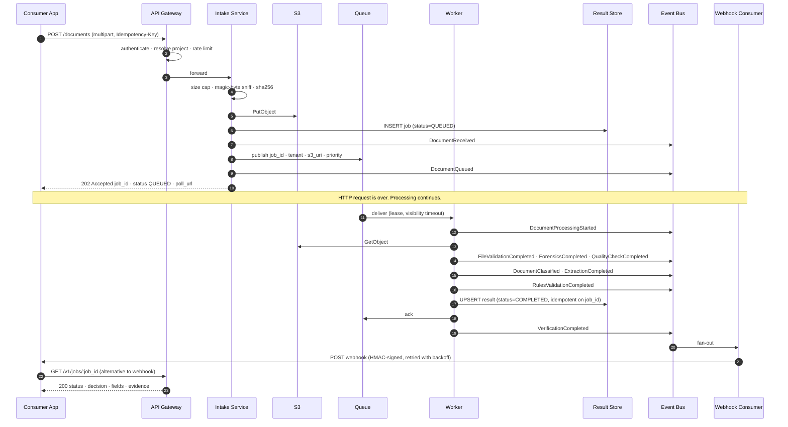

# Document Intelligence Platform — Architecture & Operations

_Last updated: 2026-08-07 · Pipeline: forensics → read → LLM → rules → match → score_

---

## 1. Executive Summary

The Document Intelligence Platform is a two-tier document-verification stack:

- **Web-UI** — Next.js 16 app (auth, dashboards, applicant/case CRUD, multipart document uploads written to **S3 object storage**). Owns all persistence.
- **Web-api** — Stateless FastAPI service that runs the verification pipeline (**forensics → read → LLM → rules → field-match → score**) and returns a decision.

The verifier runs fully on-prem against a local **Ollama** vision model (`qwen3-vl:8b`), so there is **no per-document SaaS cost**. There is **no OCR engine**: the read stage lifts an existing text layer or renders the page to an image, and the vision model reads the page itself. The same `OLLAMA_URL` knob can point at any OpenAI-compatible gateway when self-hosting is outgrown. Document forensics (duplicate detection, PDF metadata tampering, EXIF inspection, Error Level Analysis) runs in-process before any AI stage — model-free and fully explainable.

> **Sections 1–10 describe the system as built**, in which the API runs the pipeline synchronously inside the HTTP request. **[Section 11](#11-target-architecture--queue-based--event-driven) specifies the queue-based, event-driven target architecture** — 202-Accepted intake, durable queue, stateless worker pools, event bus and webhook delivery — together with the incremental migration path.

---

## 2. Component Diagram



### Components

| Component  | Tech                                                    | Role                                                   | State                          |
| ---------- | ------------------------------------------------------- | ------------------------------------------------------ | ------------------------------ |
| Web-UI     | Next.js 16, React 19, Tailwind 4, Prisma 6, Postgres 16 | User-facing pages, auth, persistence, file storage     | Stateful (Postgres + disk)     |
| Web-api    | FastAPI 0.115, Uvicorn 0.30, Pydantic 2.9               | Pure verification engine (6-stage pipeline)            | **Stateless**                  |
| Forensics  | hashlib (stdlib) + pypdf 5.1 + Pillow 10 + ELA          | Deterministic integrity / tampering signals (no model) | In-process                     |
| Ollama     | `qwen3-vl:8b` (~6.1 GB)                                 | Reads page images / text and extracts fields           | Model weights on disk          |
| Postgres   | PG 16                                                   | Applicants, cases, documents, verification runs, users | Persistent                     |
| File store | S3 object storage (`S3_BUCKET`, SSE-KMS, versioned)     | Document blob storage keyed per tenant / applicant ref | Persistent (durable, 11 nines) |

---

## 3. Request Flow — Single Document Upload

Uploads are **multipart POST -> S3** — the Next.js server streams each file to `s3://<bucket>/<tenant>/<applicant-ref>/<document-id>__<filename>` and records the resulting `s3://` URI on the `Document` row. The verification request is then streamed back to the browser as Server-Sent Events so each pipeline stage lights up live.



### Pipeline stages ([Web-api/app/pipeline/runner.py](Web-api/app/pipeline/runner.py))

`PIPELINE_STAGES = ("forensics", "read", "llm", "rules", "match", "score")` — every stage emits an SSE `{event:"stage", stage:...}` frame so the UI can render real progress instead of a fake animation.

0. **Forensics** — [`forensics.py`](Web-api/app/pipeline/forensics.py). Runs **before** any AI stage on the raw bytes:
   - **SHA-256 dedupe** — same content re-submitted under a new applicant name → `duplicate_file` (+40, MANUAL_REVIEW / DATA_MISMATCH).
   - **Magic-byte vs extension** — `.pdf` whose bytes are actually JPEG → `extension_mismatch` (+30).
   - **PDF metadata** (via [`pypdf`](https://pypi.org/project/pypdf/)) — `mod_date > creation_date`, multiple `%%EOF` markers (incremental saves), `/JavaScript`, `/Launch`, `/EmbeddedFile`, overlay annotations (`/FreeText`, `/Stamp`, `/Redact`), suspicious producer/creator tags (Photoshop, GIMP, Inkscape).
   - **EXIF inspection** (Pillow) — `Software` tag = known image editor, `DateTime` / `DateTimeOriginal` in the future.
   - **Error Level Analysis** (Pillow only, no model) — re-encode JPEG at quality 90 and diff with the original; bright residual regions indicate local re-compression / splice (`ela_hotspot`, +30).
   - Output: `ForensicsReport { sha256, risk_score, worst_status, signals[] }`. Forensics never short-circuits the pipeline by itself — its risk weight is folded into `score.aggregate`.
1. **Read** — [`docread.py`](Web-api/app/pipeline/docread.py). No text recognition happens here. PDF → native text layer via `pypdfium2`; if that layer is shorter than 100 characters, render up to `DOC_MAX_PAGES` pages at `DOC_RENDER_SCALE` into base64 PNG page images. DOCX → `python-docx` paragraphs + table cells. XLSX → `openpyxl` cell values. Images → normalised with Pillow (long edge capped at `DOC_IMAGE_MAX_PX`) into a single page image. Anything else → UTF-8 decode. Returns `DocumentContent { text, pages, source }`; when `document.readable` is false the pipeline short-circuits with `UNREADABLE` (forensics report is still returned).
2. **LLM** — Ollama `/api/generate` with `format=json`, `temperature=0`. One retry on malformed JSON.
3. **Rules** — [`rules.py`](Web-api/app/pipeline/rules.py). 25+ doc-type rule sets covering expiry windows (passport `not_expired`, bank statement 90 days, employment letter 12 months, SSA letter 120 days, …), minimum field presence, type-specific guards.
4. **Field match** — [`field_match.py`](Web-api/app/pipeline/field_match.py). Applicant-claimed values vs extracted values via RapidFuzz; name aliases, DOB format normalisation, `+10` risk per mismatch.
5. **Score** — [`score.py`](Web-api/app/pipeline/score.py). `risk_score = rule_weights + 10×mismatches + forensics_signals`, clamped to 0..100. Worst-of(rule_status, match_status, forensics_status) decides the final status: `PASSED` / `FAILED` / `MANUAL_REVIEW` / `UNREADABLE` / `EXPIRED` / `DATA_MISMATCH`. Thresholds: `RISK_PASS_MAX=20`, `RISK_FAIL_MIN=70`.

### Why three layers? Forensics _and_ document read _and_ a vision LLM (all are required)

The three stages do different jobs and none can replace the others:

| Stage                                                           | Input it accepts                                                               | Output it produces                                                                     | Why we need it                                                                                                                                                                                                                                                                                                                                                                          |
| --------------------------------------------------------------- | ------------------------------------------------------------------------------ | -------------------------------------------------------------------------------------- | --------------------------------------------------------------------------------------------------------------------------------------------------------------------------------------------------------------------------------------------------------------------------------------------------------------------------------------------------------------------------------------- |
| **Forensics** (hashlib + pypdf + Pillow + ELA)                  | Raw bytes + declared MIME + file name                                          | `ForensicsReport` with explainable tampering signals                                   | Catches fraud that text-level analysis cannot see: a Photoshopped Aadhaar still reads cleanly; a re-submitted bank statement still passes every rule; a PDF with overlay annotations covering the original amount still reads as the forged number. All checks are deterministic and model-free — no GPU, no weights to download, every signal has a human-readable reason.             |
| **Document read** (pypdfium2 / python-docx / openpyxl / Pillow) | Digital PDFs, DOCX, XLSX, scanned PDFs, photos of IDs, image-only Office files | `DocumentContent { text, pages, source }` — a text layer and/or base64 PNG page images | **There is no OCR engine.** This stage only has to hand the model something it can consume: a text layer when the container already carries one (free and lossless), or a rendered page image when it doesn't. Rendering is deterministic, cheap and lossless — no recognition errors to inherit.                                                                                       |
| **LLM** (Ollama `qwen3-vl:8b`)                                  | Document text and/or page images                                               | Structured `{field: value}` JSON with semantic understanding                           | A **vision** model reads the rendered page itself, so scans and ID photos need no recognition pass in front of it. Regex / keyword extraction breaks on the layout variance of real-world IDs, bank statements and utility bills. The LLM normalises wording ("D.O.B" vs "Date of Birth" vs "Born"), handles multilingual hints, and emits a stable schema the rules engine can act on. |

In short:

- **Forensics catches tampering before the AI ever sees the document.** Skip it → duplicate / edited / spliced documents flow through to the LLM as if they were genuine.
- **The document read stage turns paper / pixels into something the model can consume.** Skip it → uploads return `UNREADABLE`.
- **The LLM turns messy pages into trustworthy fields.** Skip it → a hand-written parser would be needed per document type, per layout, per locale — unmaintainable.

PDFs with a native text layer (≥ 100 characters) skip page rendering entirely — we send the text straight to the model, which is why DOCX / XLSX / digital PDFs are cheaper than scans. Scans cost a sub-second render per page plus the vision model's pass over the image; there is no separate recognition engine to warm up or download. Forensics runs unconditionally on every byte payload — it's cheap (~50–300 ms) and free.

### Forensics signal reference

Full source: [`Web-api/app/pipeline/forensics.py`](Web-api/app/pipeline/forensics.py). Every signal is appended to `report.signals` with a code, severity, weight, and a human-readable detail string. `score.aggregate` then adds the weights to `risk_score` and folds the worst status into the final decision.

| Code                          | Severity | Weight | Trigger                                                                                        |
| ----------------------------- | -------- | ------ | ---------------------------------------------------------------------------------------------- |
| `duplicate_file`              | high     | 40     | SHA-256 already seen for a different file name in this process (per-replica).                  |
| `extension_mismatch`          | high     | 30     | File extension says PDF/PNG/JPG but the magic bytes disagree.                                  |
| `mime_mismatch`               | low      | 5      | Declared `Content-Type` doesn't match sniffed bytes.                                           |
| `pdf_unreadable_structure`    | high     | 25     | pypdf can't parse the PDF object structure.                                                    |
| `pdf_modified_after_creation` | medium   | 15     | `/ModDate` is more than 5 minutes after `/CreationDate`.                                       |
| `pdf_future_dated`            | high     | 25     | `/CreationDate` or `/ModDate` is in the future.                                                |
| `pdf_image_editor`            | medium   | 15     | `/Producer` or `/Creator` matches Photoshop / GIMP / Inkscape / LibreOffice Draw.              |
| `pdf_incremental_updates`     | medium   | 10     | More than one `%%EOF` marker (saved, then appended).                                           |
| `pdf_embedded_js`             | high     | 20     | PDF contains `/JavaScript` or `/JS`.                                                           |
| `pdf_embedded_action`         | medium   | 10     | PDF contains `/Launch` or `/EmbeddedFile`.                                                     |
| `pdf_overlay`                 | high     | 25     | PDF contains `/FreeText` / `/Stamp` / `/Redact` annotations (can cover original text).         |
| `image_unreadable`            | medium   | 10     | Pillow can't decode the image bytes.                                                           |
| `exif_image_editor`           | high     | 25     | EXIF `Software` tag matches Photoshop / GIMP / Snapseed / Lightroom / Pixelmator / Affinity.   |
| `exif_future_date`            | high     | 20     | EXIF `DateTime` or `DateTimeOriginal` is in the future.                                        |
| `ela_hotspot`                 | high     | 30     | Error Level Analysis on a JPEG shows local re-compression (mean diff ≥ 18 or > 2% hot pixels). |

Behavioural rules baked into the aggregator:

- Any signal with severity `high` → escalate status to at least `MANUAL_REVIEW`.
- `duplicate_file`, `pdf_overlay`, or `ela_hotspot` → escalate to `DATA_MISMATCH`.
- `risk_score` is the sum of all weights, clamped 0..100, added on top of rule + match risk.
- Forensics never short-circuits the read/LLM stages — the document still flows through the rest of the pipeline so the reviewer sees the full picture.

Thresholds (constants in [`forensics.py`](Web-api/app/pipeline/forensics.py)): `_ELA_QUALITY = 90`, `_ELA_MEAN_THRESHOLD = 18.0`, `_ELA_MAX_FRACTION = 0.02`, `_ELA_HARD_PIXEL = 60`. Tune in code; no env knob today (kept deterministic on purpose).

---

## 4. Infrastructure

### Minimum viable — single host docker-compose (shipped)

| Service                     | CPU          | RAM                   | Disk                                      | Notes                                                           |
| --------------------------- | ------------ | --------------------- | ----------------------------------------- | --------------------------------------------------------------- |
| `ui` (Next.js 16)           | 1 vCPU       | 512 MB                | 1 GB image + uploads volume               | Port 80                                                         |
| `api` (Uvicorn × 2 workers) | 2 vCPU       | 1 GB                  | 2 GB image                                | Internal-only; forensics + document read are in-process         |
| `ollama`                    | **4–8 vCPU** | **8 GB** for 8B model | 5 GB model + cache                        | Internal-only                                                   |
| `db` (Postgres 16)          | 1 vCPU       | 1 GB                  | 10 GB                                     | Bundled; swap to managed RDS / Aurora by setting `DATABASE_URL` |
| Uploads volume              | –            | –                     | grows with traffic (≈ 1–5 MB / doc)       | Docker named volume `uploads` mounted at `/app/uploads`         |
| Volumes                     | –            | –                     | `audit` ~ 5 KB/run · `ollama-models` 5 GB |                                                                 |

**Recommended host: 8 vCPU / 16 GB RAM / 100 GB SSD, Linux + Docker Engine 24+. No GPU required.**

### Production-grade — horizontal scale

- **UI** behind nginx / Traefik + Let's Encrypt → 2…N replicas (stateless app, sessions in cookie).
- **api** — stateless; horizontal scaling is unbounded. The in-process forensics dedupe cache (`_SEEN_HASHES`) is per-replica only — cross-replica dedupe lives in Postgres (`Document.sha256` index, planned).
- **ollama** → 1× GPU node (T4 / A10 / L4) gives **10–15× speedup**; or swap to a managed LLM by changing `OLLAMA_URL`.
- **Postgres** → managed (RDS / Cloud SQL / Aurora Serverless).
- **uploads** — land in **S3** (or any S3-compatible endpoint: MinIO, Ceph RGW, Cloudflare R2, Wasabi). Object storage is shared by construction, so every UI and worker replica reads the same bytes with no shared filesystem to mount. Enable versioning, SSE-KMS at rest and a lifecycle rule for retention.
- **audit** → ship to Loki / CloudWatch / Splunk.

### Compression & storage footprint

Nothing in the stack compresses anything today. Three candidates exist and they are **not** equally safe — the stored original must stay byte-exact.

| Target                             | Verdict                             | Why                                                                                                                                                                                                                                                                                                                                                                                                             |
| ---------------------------------- | ----------------------------------- | --------------------------------------------------------------------------------------------------------------------------------------------------------------------------------------------------------------------------------------------------------------------------------------------------------------------------------------------------------------------------------------------------------------- |
| Uploaded originals in S3           | **Never re-encode**                 | [`forensics.py`](Web-api/app/pipeline/forensics.py) is built on byte-exact originals: re-saving changes the `sha256` (kills `duplicate_file`), makes every JPEG look spliced to ELA, and rewrites or destroys EXIF `Software` / `DateTime` and PDF `/ModDate`, `%%EOF` counts and `/FreeText` annotations.                                                                                                      |
| Uploaded originals — storage class | **Use this instead**                | PDFs and JPEGs are already compressed, so gzip buys ~2%. Cut cost with S3 Intelligent-Tiering or a lifecycle rule to Glacier IR, not with re-encoding.                                                                                                                                                                                                                                                          |
| Rendered page images → LLM         | **Safe win, verify accuracy first** | [`_encode_png`](Web-api/app/pipeline/docread.py) emits lossless PNG, the wrong codec for a rasterised page. JPEG q≈85 typically cuts the payload 3–6×, shrinking the base64 bloat (+33%) and Ollama's image-preprocessing time. These are _derived_ images, so forensics is unaffected — but the model reads 8pt print, so regression-test extraction before switching. `DOC_RENDER_SCALE` is the bigger lever. |
| `audit/YYYY-MM-DD/*.jsonl`         | **Safe win**                        | Pure text, compresses ~10–20×. Gzip on daily rotation — closed days only, never the active file, since the audit record is append-only regulatory evidence.                                                                                                                                                                                                                                                     |

### Network topology (compose)



---

## 5. Cost Model (USD/month, illustrative)

### Self-hosted CPU only — small org (≤ 5 000 docs/month)

| Item                | Spec                                                              | $/month        |
| ------------------- | ----------------------------------------------------------------- | -------------- |
| 1× VM               | 8 vCPU / 16 GB / 100 GB (Hetzner CCX23, Linode 16 GB, OCI Ampere) | **30 – 80**    |
| Managed Postgres    | 1 vCPU / 2 GB                                                     | 25 – 50        |
| S3 for uploads      | 50 GB standard + requests                                         | 1 – 5          |
| Backups (snapshots) | –                                                                 | 5 – 10         |
| **Total**           |                                                                   | **~ 65 – 155** |

LLM cost: **$0** (Ollama runs locally).

### Self-hosted with GPU — mid (50 000 docs/month)

| Item             | Spec                         | $/month         |
| ---------------- | ---------------------------- | --------------- |
| GPU VM (Ollama)  | 8 vCPU / 32 GB / 1× T4 or L4 | **300 – 600**   |
| API/UI VM        | 4 vCPU / 8 GB                | 30 – 60         |
| Postgres         | 2 vCPU / 4 GB                | 60 – 120        |
| Disk for uploads | 200 GB attached volume       | 5 – 15          |
| **Total**        |                              | **~ 400 – 800** |

### Cloud LLM swap (when self-hosting is outgrown)

Set `OLLAMA_URL` to a compatible gateway — no code change. Typical doc is ~2–4 K input + 500 output tokens.

| Provider / model         | ~$ per 1 000 docs |
| ------------------------ | ----------------- |
| OpenAI `gpt-4o-mini`     | 3 – 5             |
| Anthropic `claude-haiku` | 3 – 5             |
| Groq `llama-3.1-8b`      | 0.1 – 0.3         |
| Self-hosted              | 0                 |

### What is **not** billed

- pypdfium2 / python-docx / openpyxl / Pillow — permissive open-source licences
- Qwen3-VL — Apache 2.0
- Per-seat UI cost

---

## 6. Multiprocessing & Concurrency

### Baseline: how long does one file take?

Measured on a Windows dev box, **CPU only**, `qwen3-vl:8b`. These are the times one isolated request takes — concurrency math below builds on top of these numbers.

| File type / shape           | Forensics                                        | Read stage                      | LLM stage                                    | Rules + match + score | **Total / file**            |
| --------------------------- | ------------------------------------------------ | ------------------------------- | -------------------------------------------- | --------------------- | --------------------------- |
| DOCX / XLSX (native text)   | 20 – 80 ms (no PDF/EXIF inspection)              | < 100 ms                        | 15 – 35 s                                    | < 50 ms               | **~15 – 35 s**              |
| PDF with embedded text      | 50 – 200 ms (pypdf metadata + JS / overlay scan) | 200 – 500 ms                    | 15 – 35 s                                    | < 50 ms               | **~15 – 35 s**              |
| PDF scanned / photo / image | 100 – 300 ms (+ ELA on JPEGs)                    | ~100 – 400 ms per rendered page | 15 – 35 s (vision pass over the page images) | < 50 ms               | **~15 – 40 s**              |
| First request after boot    | unchanged                                        | unchanged                       | +30 s (Ollama warm)                          | –                     | **+30 s, one-time**         |
| With a GPU (T4 / L4)        | unchanged                                        | same as above                   | **2 – 5 s**                                  | < 50 ms               | **~3 – 6 s** (digital docs) |

Rule of thumb: **~20 s per file** on the default CPU box, digital or scanned — removing the recognition pass collapsed the old scan penalty to a sub-second render, so the vision model's inference now dominates every shape of document. A GPU collapses the LLM step ~10× and is the single biggest lever.

### How requests flow when many users upload at once



**Bottom line:** every upload is accepted instantly. The number that are _actively crunching_ at any moment equals **`min(WEB_API_WORKERS, Ollama capacity)`**. Everything else waits politely in the socket backlog — no failures, no timeouts.

### Per-layer limits (today's defaults)

| Layer              | Mechanism                                                   | Default                                                                     |
| ------------------ | ----------------------------------------------------------- | --------------------------------------------------------------------------- |
| Web-UI (Next.js)   | Node async I/O                                              | ~unlimited (DB + forward only)                                              |
| Postgres           | Connection pool                                             | hundreds in parallel                                                        |
| Uvicorn workers    | OS processes, true parallel                                 | `WEB_API_WORKERS=2` ([Dockerfile](Web-api/Dockerfile)) — set ≈ 1× CPU count |
| FastAPI per worker | async loop; sync calls (today's `httpx.Client`) block it    | **1 in-flight per worker**                                                  |
| Document read      | In-process `pypdfium2` render + Pillow encode (native code) | bounded by `DOC_MAX_PAGES` (4) per file                                     |
| Ollama (CPU)       | **single inference at a time per model**                    | concurrency = 1                                                             |
| Ollama (GPU)       | KV-cache batching                                           | concurrency ≈ 4–8 on T4 / L4                                                |
| Upload sweeper     | rate-limited (1×/hour), non-blocking                        | [runs.ts](Web-UI/src/lib/db/runs.ts)                                        |

### Realistic concurrency today

| Setup                                   | Active in parallel | 10 users × 3 docs (30 docs) wall-clock |
| --------------------------------------- | ------------------ | -------------------------------------- |
| Default: 2 workers, CPU-only Ollama     | **1–2**            | ~12–13 min                             |
| Default + async httpx fix (roadmap #12) | 1–2                | ~12 min (still gated by Ollama)        |
| 8 workers, CPU-only Ollama              | **1**              | ~12 min — workers wait for Ollama      |
| 8 workers, **1× T4 GPU** Ollama         | **4–8**            | **~45 – 90 s**                         |
| 8 workers, 2× Ollama replicas (CPU)     | 2                  | ~6 min                                 |
| 8 workers, GPU + async httpx            | 4–8                | < 1 min                                |

### Why workers alone don't help on CPU-only Ollama

[Web-api/app/pipeline/llm.py](Web-api/app/pipeline/llm.py) uses a **synchronous** `httpx.Client`, which blocks the worker's event loop for the full 15–35 s of the LLM call. With the model running on CPU, Ollama itself can only process one inference at a time. So no matter how many workers we add, only one is ever doing useful LLM work — the rest are blocked waiting their turn at the same Ollama instance.

### Scaling roadmap — pick the level required

| User load (concurrent submitters) | Recommended setup                                                                                                                      | Effort                                |
| --------------------------------- | -------------------------------------------------------------------------------------------------------------------------------------- | ------------------------------------- |
| 1 – 3                             | As-is: 2 workers, CPU Ollama                                                                                                           | Zero                                  |
| 5 – 10                            | `WEB_API_WORKERS=4` + **GPU** for Ollama (T4 / L4)                                                                                     | Hardware swap, no code change         |
| 10 – 30                           | `WEB_API_WORKERS=8` + GPU + **async httpx** (#12)                                                                                      | One file change in `llm.py`           |
| 30 – 100                          | Above + **2–4 Ollama replicas** behind a load balancer                                                                                 | Compose / k8s topology change         |
| 100+ (bursty)                     | Add **job queue** (Redis + RQ / Celery): UI returns 202, worker pool processes, user polls / gets webhook                              | Architectural shift — moderate effort |
| 1 000+ sustained                  | Multi-region: GPU Ollama pool + autoscaling API pool + shared filesystem (NFS / EFS / Azure Files) for uploads + read-replica Postgres | Cloud-native deployment, infra heavy  |

### Hardening that pairs with scale-out

- **Rate-limit** `/api/pipeline/run` per token / IP (roadmap #17) — keeps one buggy client from starving the queue.
- **Per-request timeout** already enforced (`OLLAMA_TIMEOUT_S`, default 180 s) so a hung inference can't pin a worker forever.
- **Healthchecks** drop unhealthy API / Ollama replicas from the LB automatically (compose `depends_on: condition: service_healthy` today; same hook in k8s readiness probes).
- **Audit log** is per-request and lock-free, so it does not bottleneck under load.

### TL;DR

- **Single user, single document?** Works in 15–35 s.
- **Single user, multiple documents?** Today they process sequentially (only 1–2 workers, Ollama serialises).
- **Multiple users at once?** All accepted; ~2 actually crunching, rest queue.
- **Want true 10–20 parallel?** Add a GPU and bump `WEB_API_WORKERS` — no code change to the pipeline.

---

## 7. Latency & Throughput (observed)

Measured on a Windows dev box, **CPU only**, `qwen3-vl:8b`.

### Per document

| Document type             | Read                            | LLM                 | Rules + match + score | **Total/doc**      |
| ------------------------- | ------------------------------- | ------------------- | --------------------- | ------------------ |
| DOCX / XLSX (native text) | < 100 ms                        | 15 – 35 s           | < 50 ms               | **15 – 35 s**      |
| PDF with text layer       | 200 – 500 ms                    | 15 – 35 s           | < 50 ms               | **15 – 35 s**      |
| PDF scanned / image       | ~100 – 400 ms per rendered page | 15 – 35 s (vision)  | < 50 ms               | **15 – 40 s**      |
| First request after boot  | unchanged                       | +30 s (Ollama warm) | –                     | **+30 s one-time** |

### Per applicant (typical 3 documents: ID + address + income)

| Hardware           | Sequential | With 2 API workers (CPU)         | With GPU (T4) |
| ------------------ | ---------- | -------------------------------- | ------------- |
| 8 vCPU CPU only    | 60 – 120 s | ~ 60 – 120 s (Ollama serialises) | –             |
| 8 vCPU + 1× T4 GPU | 6 – 15 s   | 4 – 8 s                          | **4 – 8 s**   |
| Stub mode (CI)     | < 0.5 s    | < 0.5 s                          | < 0.5 s       |

### Sustained throughput (peak)

| Setup                      | Docs/hour        |
| -------------------------- | ---------------- |
| CPU only                   | 30 – 60          |
| 1× T4 GPU                  | 400 – 900        |
| Stub mode (CI / load test) | 5 000 per worker |

---

## 8. Security Controls (in code)

| Control                  | Where                                                                                                                                          | Default                                                |
| ------------------------ | ---------------------------------------------------------------------------------------------------------------------------------------------- | ------------------------------------------------------ |
| Bearer-token auth        | `Authorization: Bearer $WEB_API_TOKEN` on every `/api/*` route ([Web-api/app/security.py](Web-api/app/security.py))                            | Empty = dev only                                       |
| Request-size cap         | `MaxBodySizeMiddleware` → HTTP 413                                                                                                             | 25 MB (`MAX_UPLOAD_BYTES`)                             |
| Magic-byte sniffer       | `assert_allowed_upload()` rejects ext/content mismatch → HTTP 415                                                                              | PDF, DOCX, XLSX, JPG, PNG, GIF, TIFF, TXT              |
| CORS                     | `CORS_ORIGINS` env, comma-separated                                                                                                            | `http://localhost:3000`                                |
| Request-Id propagation   | `X-Request-Id` header echoed; logged on every line                                                                                             | uuid4 if absent                                        |
| Audit log                | JSON per `run_id` in `AUDIT_DIR/YYYY-MM-DD/`                                                                                                   | `/var/lib/hpd/audit` in container                      |
| Object encryption        | SSE-KMS on the uploads bucket; TLS in transit; bucket policy denies unencrypted `PutObject`                                                    | enforced at the bucket                                 |
| Upload retention         | S3 lifecycle rule on the uploads bucket (expire current + noncurrent versions); admin reset / `npm run db:reset-processed` still works for dev | recommended: 30–365 day expiry depending on PII policy |
| Reverse-proxy headers    | `--proxy-headers --forwarded-allow-ips='*'`                                                                                                    | on                                                     |
| Compose secret fail-fast | `${WEB_API_TOKEN:?…}` blocks boot if unset                                                                                                     | enforced                                               |

---

## 9. Operations Runbook

### Bring up

```bash
cp .env.example .env             # set WEB_API_TOKEN and JWT_SECRET (DATABASE_URL optional — bundled `db` service is used if unset)
docker compose up -d             # first run downloads the model (~5 GB)
docker compose logs -f ollama-pull
```

### Health probes

```bash
# From anywhere with network reach to the server:
curl http://52.66.180.185:81/livez      # process up
curl http://52.66.180.185:81/readyz     # Ollama reachable + mode snapshot
curl http://52.66.180.185:81/health     # back-compat alias for /readyz

# From inside the host:
docker compose exec api curl localhost:8000/readyz
```

### Smoke test

```bash
curl -X POST http://52.66.180.185:81/api/pipeline/run \
  -H "Authorization: Bearer $WEB_API_TOKEN" \
  -F "file=@./passport.pdf" \
  -F "document_type=passport" \
  -F "applicant_name=Jane Doe"
```

### Scaling

```bash
docker compose up -d --scale api=4        # add API workers (stateless)
# For Ollama on GPU: separate GPU host, point OLLAMA_URL at it
```

### Audit retention

Audit JSON is partitioned by date under `AUDIT_DIR`. A log-rotation policy should be applied externally (cron + `find -mtime +90 -delete` or ship to object storage).

### Backup checklist

- Postgres dumps daily.
- S3 uploads bucket — versioning + cross-region replication; no separate snapshot job needed.
- `audit/` volume — daily snapshot or stream to log aggregator.
- `ollama-models/` — disposable, regenerated by `ollama-pull` on first boot.

---

## 10. Roadmap (what's not done yet, prioritised)

| #     | Item                                                                    | Why it matters                         |
| ----- | ----------------------------------------------------------------------- | -------------------------------------- |
| ✅ 17 | Rate limit `/api/pipeline/run` (in-process token bucket per token / IP) | One client can pin Ollama              |
| ✅ 12 | Long-lived `httpx.AsyncClient` to Ollama                                | Saves TCP setup, frees worker loop     |
| ✅ 13 | CI (GitHub Actions: pytest + tsc)                                       | Catch regressions                      |
| –     | TLS / reverse proxy in front of UI                                      | HTTP only today                        |
| ✅ –  | S3 object storage for uploads                                           | Shared by construction across replicas |
| –     | Queue + event bus (see §11 target architecture)                         | Synchronous pipeline caps throughput   |
| –     | `classify` stage — identify the document type before extraction (§10.1) | Type is currently taken on trust       |
| 15    | Locale-aware date parsing                                               | US-style only today                    |
| 18    | Ollama HA — retries + model fallback                                    | Single point of failure                |

None of these are deployment blockers; the system as committed handles uploads end-to-end with real risk scores.

### 10.1 Planned: `classify` stage — identify the document before extracting

> **Status: specified, not shipped.** No `classify` module exists in [Web-api/app/pipeline/](Web-api/app/pipeline/) today.

**Problem.** `document_type` is already optional on both endpoints (`Optional[DocumentType] = Form(None)` in [main.py](Web-api/app/main.py)) and reviewers frequently upload without picking one. Today an absent selection silently becomes `"other"`, which resolves to the generic `FIELD_SPECS["other"]` spec — `document_title`, `issuing_authority`, `applicant_name`, `date` — so a passport uploaded with no type set is never checked for an expiry date, and no rule set applies. A **wrong** selection is worse: the pipeline trusts it, `build_extraction_prompt` states it as fact to the model, and a pay stub filed as `passport` produces missing-field failures that look like a document defect rather than a filing error.

**Proposal.** Insert a `classify` stage between `read` and `llm`:

```
forensics → read → classify → llm → rules → match → score
```

The stage sends the page images / text layer to the same vision model with a short prompt listing the known catalog codes and asks for `{"document_type": "...", "confidence": 0.0}`. The result then gates the rest of the run:

| Condition                                                          | Outcome                                                                |
| ------------------------------------------------------------------ | ---------------------------------------------------------------------- |
| Detected type is in the catalog, no user selection                 | **Proceed** using the detected type as the effective `document_type`   |
| Detected type matches the user's selection                         | **Proceed** — selection confirmed                                      |
| Detected type is not in the catalog, or confidence below threshold | **Return early** — `MANUAL_REVIEW`, "could not identify document type" |
| Detected type contradicts the user's selection                     | **Return early** — `DATA_MISMATCH`, "uploaded a _X_, filed as _Y_"     |

Both early returns happen **before** the extraction call, so a misfiled document costs one LLM round-trip instead of two.

**Design constraints worth settling before implementation:**

- **Which vocabulary does the classifier emit?** There are two in the repo: legacy short codes (`passport`, `pay_stub`) in [`FIELD_SPECS`](Web-api/app/pipeline/prompts.py) / [`RULES`](Web-api/app/pipeline/rules.py), and catalog codes (`primary_document__drivers_license`) in [`DOCUMENT_RULES`](Web-api/app/pipeline/document_rules.py). Document types are also DB-driven and editable via `/api/document-types`, so the prompt's list has to be built at runtime, not hardcoded.
- **Cost.** Classification is a second `/api/generate` call. Prompt processing of the page images dominates on CPU, so this is not a cheap add — expect it to roughly double per-document latency unless the [LLM response cache](Web-api/app/pipeline/llm.py) is extended to cover it (its `_cache_key` currently includes `document_type`, which a classify call does not have yet).
- **Status vocabulary.** Reusing `MANUAL_REVIEW` / `DATA_MISMATCH` avoids a Prisma migration; a dedicated `TYPE_MISMATCH` value would read better in the UI but requires a schema change plus badge/filter updates in the Web-UI.
- **Fail-open vs fail-closed.** A hard `FAILED` on an unrecognised document would reject genuine-but-unusual paperwork on a classifier's word. `MANUAL_REVIEW` keeps a human in the loop, consistent with how low LLM confidence is already handled in [`score.py`](Web-api/app/pipeline/score.py).
- **`PIPELINE_STAGES`** in [runner.py](Web-api/app/pipeline/runner.py) is kept in lockstep with the Web-UI progress component, so adding `classify` is a coordinated front-end + back-end change.

---

## 11. Target Architecture — Queue-Based & Event-Driven

> **Status: design target, not shipped.** Everything in §1–§10 describes code that runs today, where the API executes the pipeline **synchronously** inside the request and returns the decision on the same connection. This section specifies the asynchronous refactor. Items marked **(new)** do not exist in the repository yet.

### 11.1 Why change

The synchronous design has three hard ceilings:

| Ceiling          | Cause today                                                                      | Effect                                                   |
| ---------------- | -------------------------------------------------------------------------------- | -------------------------------------------------------- |
| Request duration | The HTTP request is held open for the whole pipeline (seconds to minutes on CPU) | Client timeouts, proxy 504s, retries that duplicate work |
| Backpressure     | Concurrency is bounded only by a token bucket that **rejects** excess requests   | Load spikes become 429s instead of queued work           |
| Failure recovery | A crashed replica loses in-flight work; there is no record that the job existed  | Silent data loss; the caller must resubmit               |

Queueing decouples **accepting** work from **doing** work. The API becomes fast and predictable; capacity becomes a worker-count dial; a spike becomes queue depth instead of errors.

### 11.2 Architecture flow



The **queue is the asynchronous boundary**. Everything above it runs inside the client's HTTP request and must stay in the low hundreds of milliseconds. Everything below it runs on worker time and may take as long as it takes.

### 11.3 Async request sequence



### 11.4 Response patterns

**Submission — always 202, never a decision.**

```http
POST /v1/documents
Authorization: Bearer <project-token>
Idempotency-Key: 9f2c…            # optional; replays return the original job_id
Content-Type: multipart/form-data
```

```http
HTTP/1.1 202 Accepted
Location: /v1/jobs/2f8a1c94-…
Content-Type: application/json

{
  "job_id": "2f8a1c94-…",
  "request_id": "req_01HZ…",
  "status": "QUEUED",
  "poll_url": "/v1/jobs/2f8a1c94-…",
  "estimated_seconds": 12
}
```

The client then receives the result by **either** mechanism — both are supported, and a client may use both:

| Mechanism | Contract                                                                                                                   | When to use                            |
| --------- | -------------------------------------------------------------------------------------------------------------------------- | -------------------------------------- |
| Webhook   | Platform `POST`s the final payload to the project's registered URL, HMAC-SHA256 signed, retried with exponential backoff   | Default. No polling cost.              |
| Polling   | `GET /v1/jobs/{job_id}` → `QUEUED` / `PROCESSING` / `COMPLETED` / `FAILED` / `MANUAL_REVIEW`, with `Retry-After` when open | Clients that cannot expose an endpoint |

`GET /v1/jobs/{job_id}` is the single source of truth. A webhook is a delivery optimisation, never the only copy of the result.

### 11.5 Lifecycle events

Every event carries the same envelope so consumers can be written generically:

```json
{
  "event_id": "evt_01HZ…",
  "event_type": "ExtractionCompleted",
  "occurred_at": "2026-08-07T10:14:22.481Z",
  "tenant_id": "acme",
  "project_id": "acme-onboarding",
  "job_id": "2f8a1c94-…",
  "request_id": "req_01HZ…",
  "sequence": 8,
  "data": {}
}
```

`sequence` is monotonic per `job_id`, so a consumer that receives events out of order can still reconstruct the timeline.

| #   | Event                       | Emitted by | Meaning                                                        |
| --- | --------------------------- | ---------- | -------------------------------------------------------------- |
| 1   | `DocumentReceived`          | Intake     | Bytes accepted and stored; job row created                     |
| 2   | `DocumentQueued`            | Intake     | Job published to the processing queue                          |
| 3   | `DocumentProcessingStarted` | Worker     | A worker leased the job                                        |
| 4   | `FileValidationCompleted`   | Worker     | Container, MIME and size checks passed                         |
| 5   | `ForensicsCompleted`        | Worker     | Tampering signals collected (dedupe, metadata, EXIF, ELA)      |
| 6   | `QualityCheckCompleted`     | Worker     | Resolution, blur, glare, skew, completeness scored             |
| 7   | `DocumentClassified`        | Worker     | Vision LLM determined the document type + confidence           |
| 8   | `ExtractionCompleted`       | Worker     | Structured fields returned against the selected schema         |
| 9   | `RulesValidationCompleted`  | Worker     | Rules Engine verdict returned (skipped events are not emitted) |
| 10  | `VerificationCompleted`     | Worker     | Terminal success — final decision persisted                    |
| 11  | `ManualReviewRequired`      | Worker     | Terminal — confidence or risk requires a human                 |
| 12  | `RetakeRequired`            | Worker     | Terminal — document unusable; the client should re-capture     |
| 13  | `ProcessingFailed`          | Worker/DLQ | Terminal — permanent failure after retries exhausted           |

Events 10–13 are **mutually exclusive**; exactly one is emitted per job.

### 11.6 Event consumers

Each consumer has its own subscription and its own retry/DLQ policy, so a slow webhook endpoint can never delay audit or monitoring.

| Consumer     | Subscribes to           | Responsibility                                                                 | Failure mode                             |
| ------------ | ----------------------- | ------------------------------------------------------------------------------ | ---------------------------------------- |
| Webhook      | Terminal events (10–13) | Signed HTTP delivery to the project's URL; per-project concurrency cap         | Retry with backoff → webhook DLQ → alert |
| Notification | 11, 12, 13              | Email / Slack / Teams to the reviewer queue                                    | Retry, then drop with a logged warning   |
| Audit        | **All** events          | Append-only immutable record keyed by `job_id` (regulatory evidence)           | Must never drop — retries indefinitely   |
| Monitoring   | All events              | Latency histograms, per-stage failure rates, queue depth, DLQ depth            | Best-effort; metrics loss is acceptable  |
| Analytics    | 7, 8, 9, 10             | Document-mix, confidence distribution, per-tenant volume for capacity planning | Best-effort; batched                     |

### 11.7 Queue requirements

| Requirement              | Implementation                                                                                                                    |
| ------------------------ | --------------------------------------------------------------------------------------------------------------------------------- |
| Durable                  | Messages persisted before the 202 is returned. A broker restart loses nothing.                                                    |
| Retry                    | Exponential backoff with jitter: 1s, 2s, 4s, 8s, 16s (`max_attempts = 5`, configurable per project)                               |
| Dead Letter Queue        | After `max_attempts`, the message moves to the DLQ with the full failure chain. DLQ depth is an alerting metric.                  |
| Idempotent               | `job_id` is the idempotency key. Result writes are `UPSERT`; re-delivery re-runs safely and overwrites identically.               |
| Backpressure             | Bounded queue depth. Beyond the high-water mark the gateway returns `503` + `Retry-After` instead of accepting work it cannot do. |
| Priority                 | `HIGH` / `NORMAL` / `LOW` per project, as separate queues consumed in weighted order (avoids starving `LOW`).                     |
| Configurable concurrency | Per-worker prefetch and per-tenant in-flight cap, so one tenant cannot monopolise the pool.                                       |
| Horizontal scaling       | Competing-consumer pattern: add worker replicas, throughput scales linearly until Ollama saturates.                               |

**Visibility timeout must exceed the worst-case stage duration**, otherwise the broker re-delivers a job that is still being processed and two workers duplicate the LLM cost. Workers extend the lease heartbeat-style for long jobs.

Broker choice is deliberately not fixed: RabbitMQ (quorum queues), AWS SQS + DLQ, Azure Service Bus, or Redis Streams with consumer groups all satisfy the table above. The worker only depends on a narrow `Queue` port, keeping the platform infrastructure independent.

### 11.8 Worker architecture

Workers are **stateless** — no local cache, no sticky routing, no in-process dedupe table. Everything they need arrives in the message or is fetched from S3 / Postgres. Any worker can process any job; killing one mid-flight only costs a redelivery.

| Worker                   | Stages owned                                         | Scaling driver                                     |
| ------------------------ | ---------------------------------------------------- | -------------------------------------------------- |
| Validation Worker        | Pre-validation: file checks, forensics, quality      | CPU-bound; cheap; scale by queue depth             |
| Vision Processing Worker | Classification, schema selection, extraction         | Bound by Ollama/GPU capacity, not by replica count |
| Rules Worker             | Optional Rules Engine call                           | Only for projects with configured rules            |
| Result Worker            | Aggregation, result-store write, terminal event emit | Light; scales with completion rate                 |

Two deployment shapes are valid:

- **Single-queue (start here)** — one worker type runs all stages inline under one lease. Simplest; one message per document; no intermediate state.
- **Stage-per-queue (scale later)** — each worker type has its own queue, so the expensive vision stage scales independently of cheap validation. Costs a state handoff between stages.

Start with single-queue. Split only when the vision stage is measurably the bottleneck.

### 11.9 Error handling

| Failure class                                                         | Treatment                                                                                                            |
| --------------------------------------------------------------------- | -------------------------------------------------------------------------------------------------------------------- |
| **Transient** — Ollama timeout, S3 5xx, broker blip                   | Retry in place with exponential backoff + jitter, up to `max_attempts`                                               |
| **Permanent** — corrupt file, unsupported container, schema violation | Fail fast, no retry. Emit `ProcessingFailed` with a reason code.                                                     |
| **Ambiguous** — low confidence, conflicting signals                   | Not an error. Terminal `ManualReviewRequired`; the job lands in the reviewer queue.                                  |
| **Unusable input** — unreadable scan, blank page                      | Terminal `RetakeRequired` with the specific quality reason (blur / glare / crop).                                    |
| **Exhausted retries**                                                 | Move to DLQ, emit `ProcessingFailed`, alert on DLQ depth. A DLQ message is replayable after the root cause is fixed. |

Retrying a permanent failure is waste; retrying a transient failure is the whole point. Classification happens at the exception boundary in the worker, never by a blanket `except Exception: retry`.

Manual review is a first-class workflow, not an error path: the reviewer's decision is written back to the result store and emits its own terminal event, so the consuming application sees a single consistent lifecycle.

### 11.10 Architecture principles

| Principle                            | What it forbids                                                                                               |
| ------------------------------------ | ------------------------------------------------------------------------------------------------------------- |
| **Queue-first**                      | No processing inside an HTTP request. The API only accepts, stores and publishes.                             |
| **Event-driven**                     | No consumer polls the database for state changes; state changes announce themselves.                          |
| **Stateless workers**                | No local disk, no in-process cache that affects the outcome, no sticky sessions.                              |
| **Infrastructure independent**       | No broker-, cloud- or vendor-specific type in domain code; adapters at the edges only.                        |
| **Multi-tenant**                     | No global state. Every row, object key, queue message and event carries `tenant_id`.                          |
| **Project-driven configuration**     | No hardcoded schema, threshold, model or webhook — all resolved per project at intake.                        |
| **Vision LLM only (no OCR)**         | No recognition engine. The model reads the page image or the native text layer.                               |
| **Rules Engine optional & separate** | Rules never live inside the pipeline; the engine receives structured data only and runs only when configured. |

### 11.11 Migration path from today's synchronous pipeline

The refactor is incremental and each step is independently shippable:

1. **Introduce the job record.** Persist a `Job` row at intake with `QUEUED`/`PROCESSING`/terminal status. Keep running synchronously; the row is written and completed within the same request.
2. **Add `GET /v1/jobs/{job_id}`.** Clients can start migrating to the polling contract before anything is asynchronous.
3. **Introduce the broker and the worker.** Publish at intake; return `202`. Keep the synchronous endpoint alive under a different path so existing callers do not break.
4. **Add the event bus** and the Audit + Monitoring consumers first — they are read-only and prove the event stream is correct before anything depends on it.
5. **Add the Webhook consumer**, per-project signing secrets and delivery retries.
6. **Add the DLQ, priority queues and per-tenant concurrency caps** once real traffic shows where the contention is.
7. **Retire the synchronous endpoint** after callers have migrated.

Step 1 must not be skipped: without a durable job record, the 202 in step 3 would be a promise the platform cannot keep.

---

## 12. Reference

- [Web-api/app/main.py](Web-api/app/main.py) — FastAPI app & middleware stack
- [Web-api/app/security.py](Web-api/app/security.py) — auth, size cap, file sniffer
- [Web-api/app/audit.py](Web-api/app/audit.py) — request-id middleware, audit writer
- [Web-api/app/pipeline/runner.py](Web-api/app/pipeline/runner.py) — pipeline orchestrator
- [docker-compose.yml](docker-compose.yml) — full stack definition
- [.env.example](.env.example) — every tunable, documented
- [Web-api/README.md](Web-api/README.md) — service-level README
