# Intelligent Telemetry & Knowledge Platform — Solution Architecture

**Document type:** Solution Architecture Design
**Audience:** Solution Architects, .NET Architects, Platform & Data Engineering, Security Review Board
**Status:** Reference design (vendor-neutral, with an example .NET / Azure mapping)

---

## Table of Contents

1. [High-Level Architecture](#1-high-level-architecture)
2. [Data Preparation / Ingestion Pipeline](#2-data-preparation--ingestion-pipeline)
3. [Event-Driven Architecture](#3-event-driven-architecture)
4. [Queue-Based Processing](#4-queue-based-processing)
5. [Worker Service Design](#5-worker-service-design)
6. [Live User Request Pipeline](#6-live-user-request-pipeline)
7. [Agent / Orchestrator](#7-agent--orchestrator)
8. [RAG Architecture](#8-rag-architecture)
9. [Controlled Query Service](#9-controlled-query-service)
10. [Security](#10-security)
11. [Long-Running Requests](#11-long-running-requests)
12. [ML / Prediction Pipeline](#12-ml--prediction-pipeline)
13. [Caching](#13-caching)
14. [Reliability](#14-reliability)
15. [Observability](#15-observability)
16. [Scalability](#16-scalability)
17. [Example End-to-End Request](#17-example-end-to-end-request)
18. [Component Responsibility Table](#18-component-responsibility-table)
19. [Technology Mapping](#19-technology-mapping)
20. [Design Decisions / Trade-Offs](#20-design-decisions--trade-offs)
21. [Interview Summary](#21-interview-summary)

---

## Problem Statement

A very large volume of vehicle, machine, telemetry and business data lands continuously in a Data Lake. Business users must be able to open a web UI and ask **one question in plain language** — without knowing whether the answer lives in a relational warehouse, in a PDF maintenance manual, or in a machine-learning model.

The platform must:

- Accept natural-language and structured questions from a web UI.
- Decide **automatically** whether the request needs SQL, semantic retrieval (RAG), an ML prediction, an analytical computation, or a combination.
- Execute large or long-running work **asynchronously**, never on an open HTTP request.
- Enforce **who the user is**, **what they may do**, and **which rows/regions/tenants they may see**.
- Be scalable, reliable, observable and secure by design.

---

## 1. High-Level Architecture

The system is deliberately split into **two independent pipelines** that share only durable storage. They have completely different latency budgets, scaling triggers and failure modes, so they are designed, deployed and scaled separately.

|                 | **A. Data Preparation / Ingestion Pipeline** | **B. Live User Request / AI Query Pipeline**          |
| --------------- | -------------------------------------------- | ----------------------------------------------------- |
| Trigger         | New data arriving in the Data Lake           | A user asking a question in the UI                    |
| Latency budget  | Minutes to hours (throughput-optimised)      | Sub-second to a few seconds (latency-optimised)       |
| Execution style | Asynchronous, event- and queue-driven        | Synchronous request/response, with async escape hatch |
| Scaling signal  | Queue depth / backlog age                    | Request rate / CPU / p95 latency                      |
| Failure impact  | Delayed freshness                            | Direct user-visible error                             |
| Owner           | Data / Platform Engineering                  | Application / AI Engineering                          |

**The critical relationship between them:** the ingestion pipeline is the _only_ writer to the serving stores (SQL Warehouse, Vector DB, Feature Store). The live pipeline is a _read-only consumer_ of those stores. This one rule keeps user-facing latency independent of ingestion volume — a million-file backlog can never slow down a user's question.

### 1.1 Combined Architecture Diagram

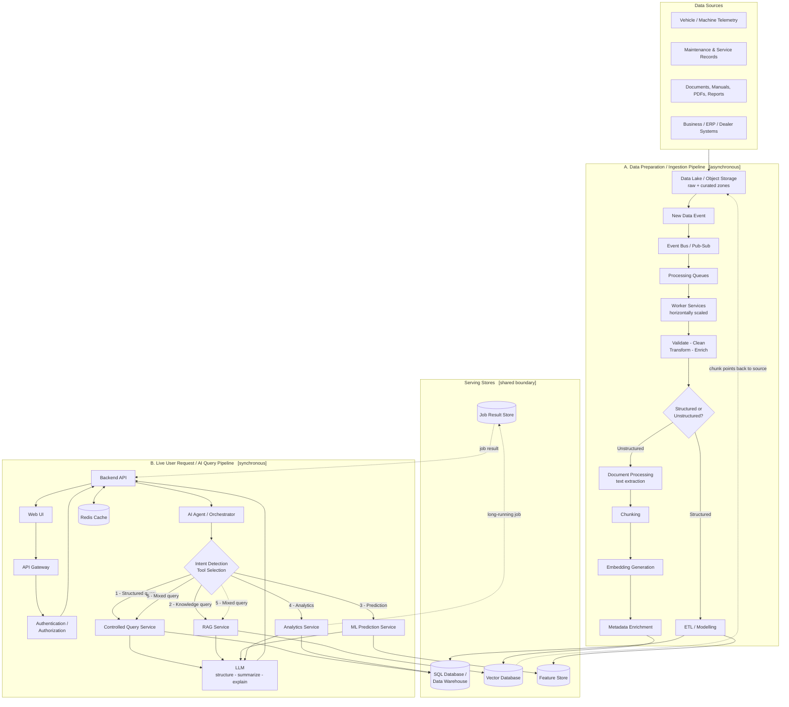

### 1.2 Reading the Diagram

- **Left-to-right in Pipeline A** is _ingestion time_: work is done **once**, in bulk, ahead of any user question.
- **Top-to-bottom in Pipeline B** is _query time_: work is done **per request**, against pre-computed, pre-indexed data.
- The **Serving Stores** band is the contract between the two. Everything above it is "prepare"; everything below it is "serve".
- The dotted line from the Vector DB back to the Data Lake shows that the vector store holds **references**, not the authoritative documents.

---

## 2. Data Preparation / Ingestion Pipeline

### 2.1 Why a Preparation Pipeline Exists

An LLM cannot answer "how many engine failures happened last month" by reading a Data Lake. Raw lake data is unmodelled, inconsistent, duplicated and enormous. Someone must convert it into two _query-ready_ shapes:

- **Numbers you can aggregate** → a relational / columnar warehouse.
- **Meaning you can search** → embeddings in a vector database.

Doing this at ingestion time (once per file) instead of query time (once per question) is the single biggest cost and latency decision in the whole design.

### 2.2 End-to-End Ingestion Workflow

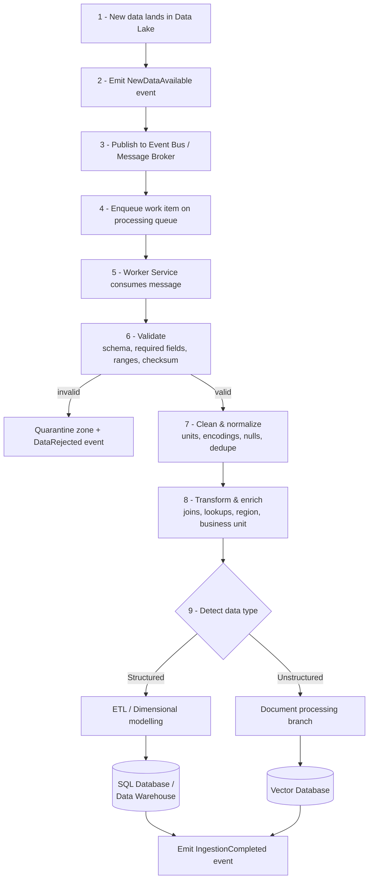

### 2.3 Structured Data Path

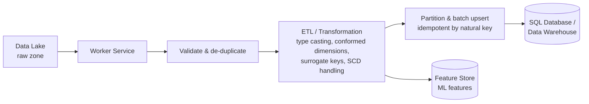

Key points:

- **Idempotent upserts keyed on a natural business key** (for example `VehicleId + EventTimestamp + SignalName`) so a redelivered message cannot double-count failures.
- **Batching** — workers write in batches (thousands of rows per round trip), not row-by-row, because per-row network round trips dominate cost at telemetry volumes.
- **Curated zone written back to the lake** so the warehouse can always be rebuilt from an immutable source.

### 2.4 Unstructured Data Path

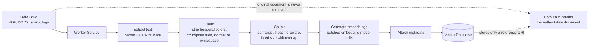

#### Chunking guidance

| Concern           | Guidance                                                                                                                               |
| ----------------- | -------------------------------------------------------------------------------------------------------------------------------------- |
| Chunk size        | Large enough to carry a complete idea, small enough to stay precise. Heading/section-aware splitting beats blind fixed-size splitting. |
| Overlap           | A modest overlap between adjacent chunks so a sentence spanning a boundary is not lost.                                                |
| Tables & diagrams | Extract tables separately and keep them intact; a split table is unusable context.                                                     |
| Traceability      | Every chunk keeps page/section offsets so the UI can cite and deep-link the exact source.                                              |

#### Chunk metadata schema

| Field                     | Purpose                                                          |
| ------------------------- | ---------------------------------------------------------------- |
| `DocumentId`              | Stable identity of the source document                           |
| `ChunkId` / `ChunkIndex`  | Ordering and deduplication within a document                     |
| `VehicleId` / `MachineId` | Ties knowledge to a specific asset                               |
| `Source`                  | Originating system or feed                                       |
| `DocumentType`            | Manual, service report, incident report, bulletin                |
| `Region`                  | **Business/data-access region** — drives authorization filtering |
| `BusinessUnit`            | Organisational scope                                             |
| `Timestamp`               | Effective/publication date — drives recency filters              |
| `Version`                 | Document revision; lets stale revisions be excluded              |
| `TenantId`                | Hard multi-tenant isolation boundary                             |
| `SourceUri`               | Pointer back to the original object in the Data Lake             |
| `Checksum`                | Detects re-processing of unchanged content                       |

### 2.5 Source of Truth vs Search Index

This distinction is frequently mishandled and is worth stating explicitly:

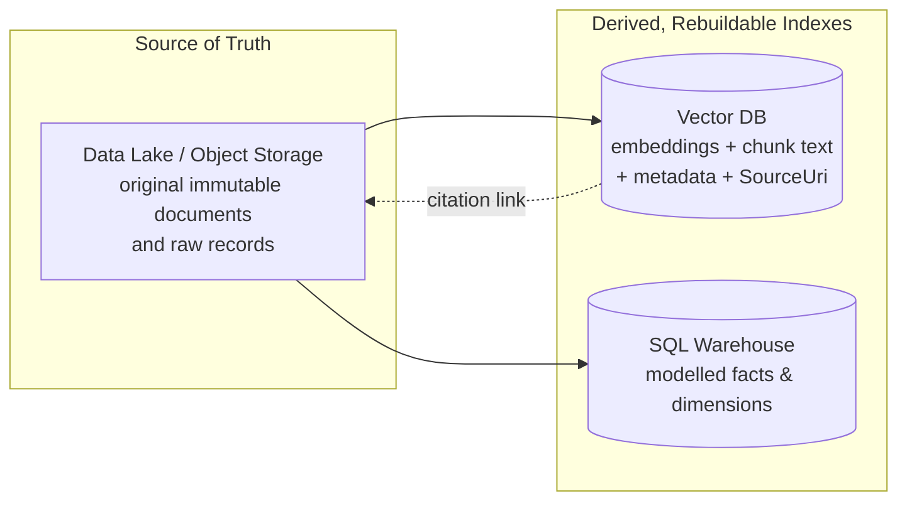

- The **original document is never deleted from the lake** and is never replaced by its embeddings.
- The Vector DB stores **embeddings, the searchable chunk text, metadata, and a reference to the source** — it is a _derived index_.
- Because both serving stores are derived, a bad embedding model, a bad chunking strategy, or a corrupted load can be fixed by **replaying** from the lake. This makes reprocessing a routine operation instead of a data-loss incident.

---

## 3. Event-Driven Architecture

### 3.1 The Five Concepts, Clearly Separated

These terms are constantly conflated. The distinction matters because they have different delivery guarantees and different failure semantics.

| Concept             | What it is                                                                                                              | Direction | Key property                                                                                       | Example                                                  |
| ------------------- | ----------------------------------------------------------------------------------------------------------------------- | --------- | -------------------------------------------------------------------------------------------------- | -------------------------------------------------------- |
| **Event**           | An immutable _fact_ that something happened, in the past tense                                                          | Produced  | Carries no instruction; the producer does not know or care who reacts                              | `NewDataAvailable`, `IngestionCompleted`, `JobCompleted` |
| **Event Bus**       | Broadcast/notification infrastructure for **fan-out**                                                                   | 1 → N     | Publisher is fully decoupled from subscribers; subscribers can be added with zero producer changes | Event Grid, EventBridge                                  |
| **Message Broker**  | The general messaging middleware hosting queues and topics, handling durability, delivery, ordering and acknowledgement | —         | Durability and at-least-once delivery                                                              | Service Bus, RabbitMQ, Kafka                             |
| **Pub/Sub (Topic)** | A publish/subscribe pattern _inside_ a broker: one message, many independent subscriptions, each with its own cursor    | 1 → N     | Each subscriber consumes independently and can fail independently                                  | Service Bus Topic, Kafka topic with consumer groups      |
| **Queue**           | A point-to-point **work list**. A message is delivered to exactly one competing consumer and removed once acknowledged  | 1 → 1     | Load levelling + competing-consumers scaling                                                       | Service Bus Queue, SQS                                   |
| **Worker Service**  | A long-running background process that _consumes_ messages and performs the actual work                                 | Consumer  | Stateless, horizontally scalable, idempotent                                                       | .NET Worker Service / container                          |

> **Rule of thumb:** an **event** says _"this happened"_; a **command/work item on a queue** says _"do this"_. Events fan out to interested parties; queue messages are units of work claimed by exactly one worker.

### 3.2 Event → Bus → Queue → Worker

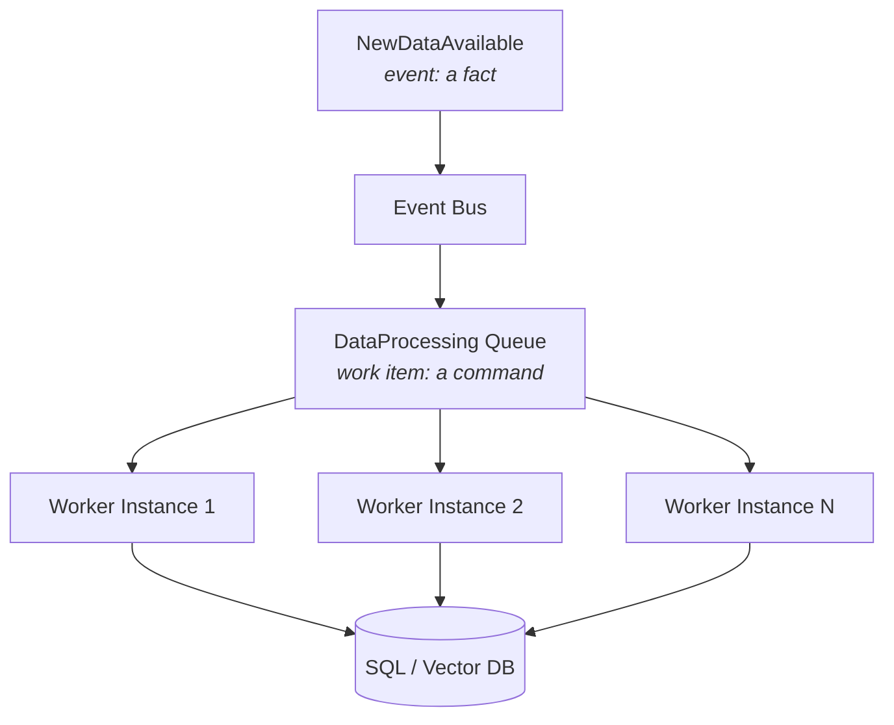

The bus **announces**; the queue **buffers and distributes**. Putting a queue between the bus and the workers is what allows a burst of a million events to be absorbed without a single worker being overwhelmed.

### 3.3 Pub/Sub Fan-Out

One fact, many independent reactions — none of which the publisher knows about:

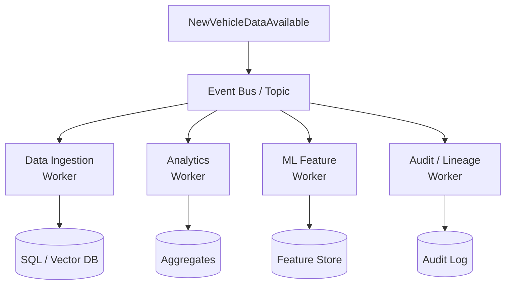

### 3.4 Why Events Give Loose Coupling

| Coupling removed          | Consequence                                                                                                                                                           |
| ------------------------- | --------------------------------------------------------------------------------------------------------------------------------------------------------------------- |
| **Identity coupling**     | The publisher does not reference any consumer. A new "Warranty Analytics Worker" is added by creating a subscription — **no change and no redeploy of the producer**. |
| **Temporal coupling**     | If the ML Feature Worker is down for an hour, its messages queue up and are processed on recovery. Ingestion is unaffected.                                           |
| **Availability coupling** | One slow or failing consumer cannot slow down the others; each subscription has its own cursor, retry policy and dead-letter queue.                                   |
| **Scale coupling**        | Each consumer scales to its own workload. Embedding generation (expensive) scales independently of structured ETL (cheap).                                            |
| **Deployment coupling**   | Teams release on independent cadences behind a versioned event contract.                                                                                              |

**Trade-offs accepted:** eventual consistency, harder end-to-end debugging (mitigated by correlation IDs — see §15), duplicate delivery (mitigated by idempotency — see §4), and the need to version event schemas additively.

---

## 4. Queue-Based Processing

### 4.1 Why a Queue Is Non-Negotiable at This Volume

Without a queue, a burst of a million files forces a choice between crashing the workers or throttling the producer. A queue converts a **spiky, unbounded arrival rate** into a **smooth, bounded processing rate**.

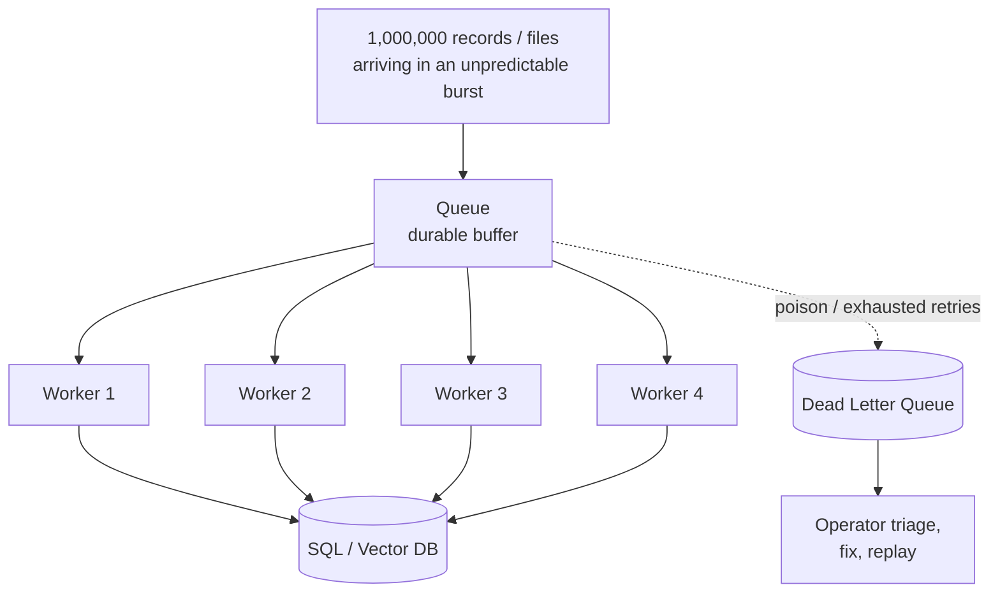

### 4.2 Properties the Queue Provides

| Property                       | How it works                                                                                                        | Why it matters here                                                         |
| ------------------------------ | ------------------------------------------------------------------------------------------------------------------- | --------------------------------------------------------------------------- |
| **Buffering / load levelling** | Bursts accumulate durably; workers drain at a sustainable rate                                                      | Nightly telemetry dumps do not require peak-sized always-on capacity        |
| **Backpressure**               | Queue depth grows and becomes the scaling signal; prefetch limits and max-concurrency cap in-flight work            | Protects the downstream database and the embedding model from being overrun |
| **Horizontal scaling**         | Competing consumers: add worker instances, throughput rises near-linearly                                           | Backlog is cleared by scaling out, not by rewriting code                    |
| **Retry**                      | Message lock is released on failure and redelivered with exponential backoff and jitter                             | Transient throttling or a brief DB failover self-heals                      |
| **Dead Letter Queue**          | After N delivery attempts the message moves to a DLQ with the failure reason                                        | One malformed file cannot block the queue forever                           |
| **Failure isolation**          | Failure is scoped to a single message                                                                               | 999,999 files still succeed while 1 fails                                   |
| **Ordering (when needed)**     | Session/partition key such as `VehicleId` gives ordering _within_ an asset while remaining parallel _across_ assets | Preserves per-vehicle event order without serialising the whole pipeline    |

### 4.3 Idempotency and Duplicate Handling

At-least-once delivery is the norm. Duplicates **will** happen — after a retry, a redeploy, a lock expiry, or a consumer crash between "work done" and "message acknowledged". The design must make duplicates harmless rather than try to prevent them.

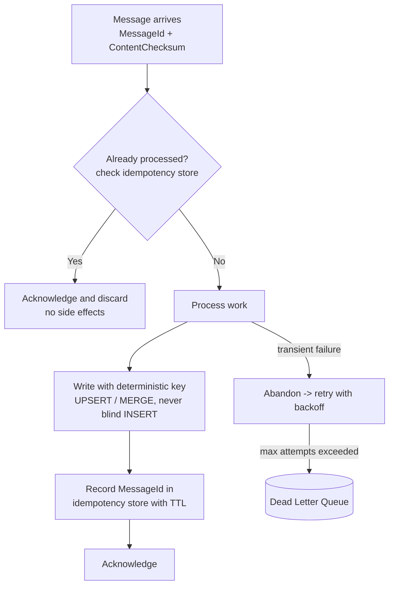

Practical rules applied throughout:

- **Deterministic identifiers.** Chunk key = `hash(DocumentId + Version + ChunkIndex)`. Reprocessing the same document overwrites the same vectors rather than creating duplicate search hits.
- **UPSERT, never blind INSERT**, on every persistence path.
- **Idempotency store** (Redis or a table) holding processed `MessageId`s with a TTL comfortably longer than the maximum retry window.
- **Checksum short-circuit.** If the content checksum is unchanged, skip the expensive embedding step entirely — the largest single cost saving in reprocessing.
- **Acknowledge only after the durable write succeeds** — never before.

---

## 5. Worker Service Design

### 5.1 Event-Driven, Not Poll-Driven

Worker Services are permanently running background services, but **what they run is triggered by messages, not by a timer scanning the Data Lake.**

|                | Continuous polling of the lake                               | Event/message-driven (chosen)               |
| -------------- | ------------------------------------------------------------ | ------------------------------------------- |
| Cost when idle | Constant listing/scan cost on a huge object store            | Near zero                                   |
| Latency        | Bounded by the poll interval                                 | Near-real-time                              |
| Discovery cost | Grows with total lake size                                   | Constant — the event names the exact object |
| Duplicate risk | High: "have I seen this file?" must be recomputed constantly | Handled once by message identity            |
| Scaling signal | None natural                                                 | Queue depth                                 |

A **small scheduled reconciliation sweep is still retained** — a low-frequency job that compares the lake against ingestion bookmarks to catch objects whose events were lost. This is a safety net, not the primary trigger. The primary path stays event-driven.

### 5.2 Worker Responsibilities

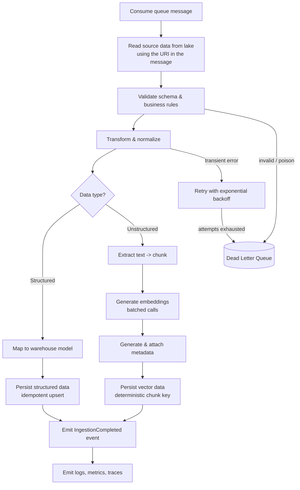

Full responsibility list:

- Consume queue messages with a bounded prefetch and renew locks on long operations.
- Read source data from the Data Lake by reference (never carry payloads in the message).
- Validate structure, ranges and business invariants; quarantine what fails.
- Transform, normalize and enrich.
- Chunk documents; generate embeddings in batches.
- Generate and attach metadata (including `Region`, `TenantId`, `Version`).
- Persist structured data idempotently to SQL / the warehouse.
- Persist vector data idempotently to the Vector DB.
- Retry transient failures with exponential backoff and jitter.
- Move poison messages to the DLQ with full diagnostic context.
- Produce completion events for downstream consumers.
- Emit structured logs, metrics and distributed traces carrying the correlation ID.
- Shut down gracefully: stop accepting new messages, finish or abandon in-flight work cleanly.

### 5.3 Worker Specialisation and Horizontal Scaling

Different work has radically different cost profiles, so workers are **specialised by workload** and each type scales on its own queue depth. Embedding generation is typically the most expensive stage and must not be throttled by cheap structured ETL sharing the same pool.

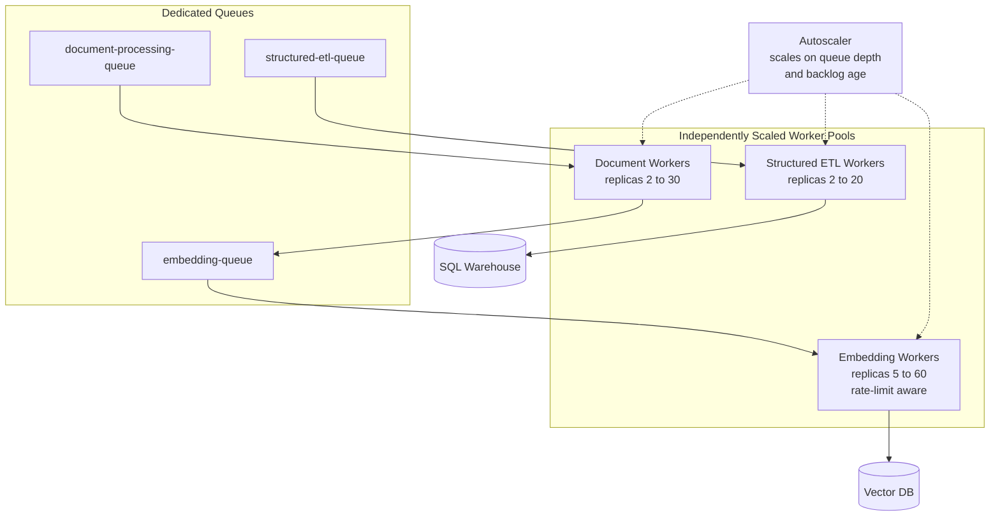

Workers are **stateless** — all state lives in the message, the lake, or the database — which is precisely what makes "add ten more replicas" a safe operation.

---

## 6. Live User Request Pipeline

### 6.1 The Governing Principle

> **The UI never decides whether the answer needs SQL, RAG, ML or analytics.**

The UI sends a question and a user identity. That is all. Intent detection and tool selection are the **Agent/Orchestrator's** responsibility, executed server-side.

Why this matters:

| If the UI decided…                        | Consequence                                                                                 |
| ----------------------------------------- | ------------------------------------------------------------------------------------------- |
| Routing logic lives in JavaScript         | It is client-side, therefore **untrusted and tamperable**                                   |
| Every new capability needs a UI release   | Tight coupling; slow delivery                                                               |
| The UI must understand the data model     | Leaks backend concerns into the presentation layer                                          |
| Mixed questions need client orchestration | The client would have to call SQL and RAG and merge results — business logic in the browser |

Routing on the server means a new tool is added, tested and released **without touching the UI at all**.

### 6.2 Request Flow

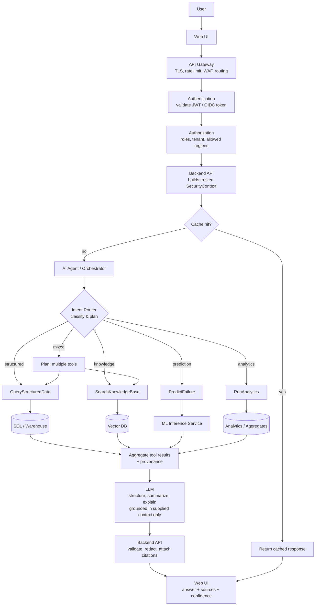

### 6.3 Sequence View

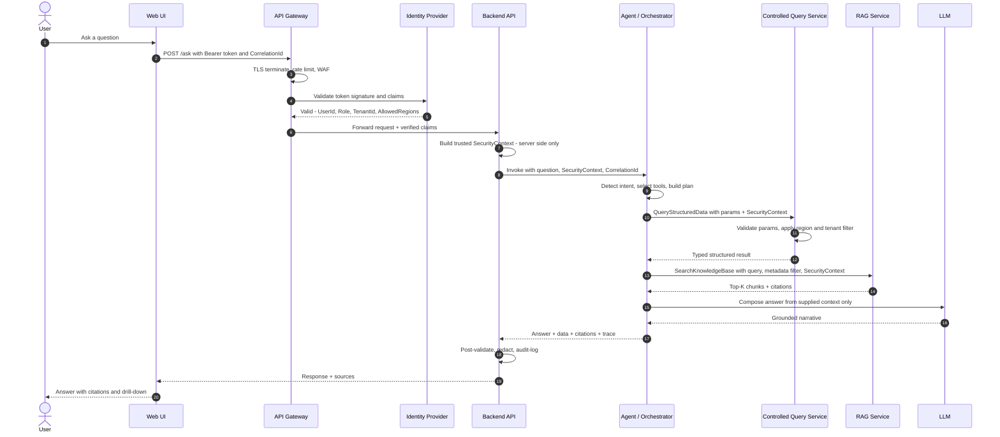

---

## 7. Agent / Orchestrator

### 7.1 What the Agent Is — and Is Not

The Agent is an **orchestration layer**, not a data-access layer.

| The Agent **does**                                        | The Agent **never**                       |
| --------------------------------------------------------- | ----------------------------------------- |
| Classify intent                                           | Connect to a database directly            |
| Select one or more approved tools                         | Author or execute free-form SQL           |
| Decompose a compound question into tasks                  | Decide what data a user is allowed to see |
| Sequence dependent tasks and parallelise independent ones | Hold or forward credentials               |
| Merge tool results into a coherent context                | Bypass validation on tool parameters      |
| Ask a clarifying question when the request is ambiguous   | Invent data not returned by a tool        |

The Agent chooses **which capability** to invoke. Trusted backend services decide **what data comes back**. This separation is the core security invariant of the design (see §10).

### 7.2 Controlled Tool Catalogue

Every tool is a strongly typed, allow-listed, server-side operation with a declared schema:

| Tool                  | Signature                                           | Backing store        |
| --------------------- | --------------------------------------------------- | -------------------- |
| `QueryStructuredData` | `(metric, dimensions, filters, dateRange)`          | SQL / Warehouse      |
| `SearchKnowledgeBase` | `(query, documentType?, region?, dateRange?, topK)` | Vector DB            |
| `RunAnalytics`        | `(analysisType, scope, dateRange)`                  | Analytics Service    |
| `PredictFailure`      | `(vehicleId, horizon)`                              | ML Inference Service |
| `GetVehicleHistory`   | `(vehicleId, dateRange)`                            | SQL / Warehouse      |

### 7.3 Intent Routing

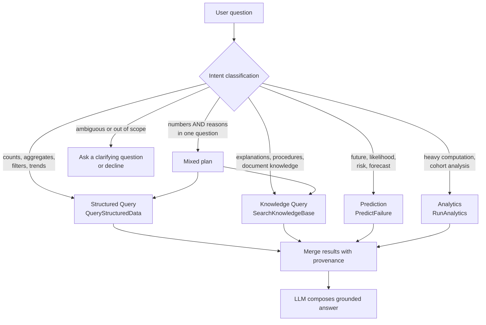

### 7.4 Worked Classifications

| Question                                                                                                     | Intent     | Route                                                           | Why                                                                                                     |
| ------------------------------------------------------------------------------------------------------------ | ---------- | --------------------------------------------------------------- | ------------------------------------------------------------------------------------------------------- |
| "How many engine failures occurred last month?"                                                              | Structured | `QueryStructuredData` → SQL                                     | A deterministic aggregate. Must be exact and auditable — never estimated by an LLM.                     |
| "What does the maintenance manual say about engine overheating?"                                             | Knowledge  | `SearchKnowledgeBase` → Vector DB                               | The answer is prose inside documents; semantic similarity is the right retrieval mechanism.             |
| "Predict the probability of this engine failing next month."                                                 | Prediction | `PredictFailure` → ML Inference                                 | Requires a trained model over engineered features; an LLM cannot compute this.                          |
| "Which model had the highest failure rate last month and what reasons are mentioned in maintenance reports?" | **Mixed**  | `QueryStructuredData` **+** `SearchKnowledgeBase` → merge → LLM | "Highest failure rate" is arithmetic; "reasons mentioned" is semantic. Two retrieval modes, one answer. |

**The mixed case is the whole point of the architecture.** The rate comes from SQL (exact), the reasons come from RAG (cited), and the LLM only _narrates_ the combination — it never produces a number of its own.

---

## 8. RAG Architecture

Retrieval-Augmented Generation has two halves that run at completely different times.

### 8.1 Indexing (Ingestion Time — Runs Once Per Document)

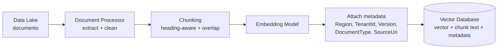

### 8.2 Retrieval (Query Time — Runs Once Per Question)

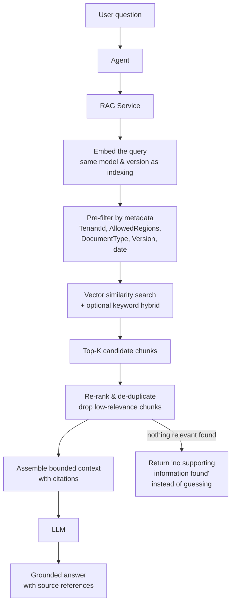

Two details that are easy to get wrong:

- **The query must be embedded with the same model and version used for indexing.** A model upgrade requires re-indexing; the embedding model version is therefore stored as chunk metadata.
- **Metadata filtering is applied _before_ similarity ranking, and is derived from the server-side `SecurityContext` — never from the user's text or the Agent's output.** Filtering after retrieval risks unauthorised content transiting the LLM.

### 8.3 Why Not Just Put the Data Lake in the LLM Context?

| Reason                       | Detail                                                                                                                                                  |
| ---------------------------- | ------------------------------------------------------------------------------------------------------------------------------------------------------- |
| **Context window**           | A lake holds terabytes; a context window holds a small fraction of a single large document. It is not a scale difference — it is a category difference. |
| **Cost**                     | Cost scales with tokens per request. Resending a corpus per question is economically impossible.                                                        |
| **Latency**                  | Larger contexts mean slower responses; users expect seconds.                                                                                            |
| **Accuracy**                 | Relevance degrades as irrelevant context grows ("lost in the middle"). A focused set of relevant chunks outperforms a large unfocused dump.             |
| **Security**                 | Loading everything destroys row/region/tenant-level authorization — the model would see data the user must never see.                                   |
| **Arithmetic**               | LLMs are unreliable at exact aggregation over large record sets. Counting is a database's job.                                                          |
| **Freshness & auditability** | Retrieval reads the current index and returns citations; a stuffed context is a stale, unciteable snapshot.                                             |

### 8.4 Choosing the Right Retrieval Mode

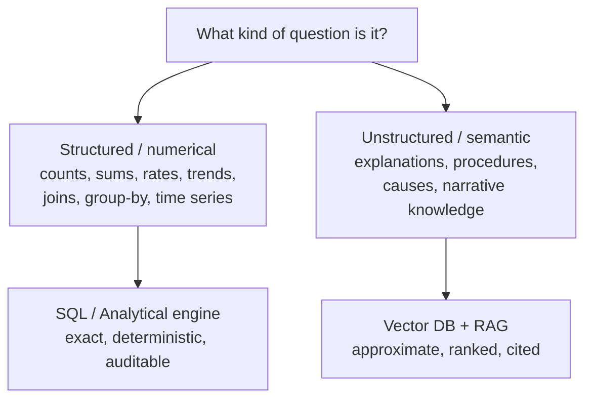

|                         | SQL / Warehouse                                   | Vector DB / RAG                           |
| ----------------------- | ------------------------------------------------- | ----------------------------------------- |
| Answers                 | "How many / how much / which top-N"               | "Why / how / what does the document say"  |
| Result                  | Exact and reproducible                            | Ranked and approximate                    |
| Guarantee               | Deterministic, auditable                          | Best-match with citations                 |
| Wrong-tool failure mode | Asking RAG to count → plausible but wrong numbers | Asking SQL for meaning → no answer at all |

**Never let the LLM compute a business metric that a database can compute exactly.**

---

## 9. Controlled Query Service

### 9.1 The Rule

> **The LLM must NEVER receive unrestricted, direct database access.**

No connection strings. No dynamic SQL authored by the model. No "just give it a read-only login" — read-only still exposes _every row of every tenant and every region_, plus unbounded scans that can take down the warehouse.

Instead, the model is offered a **narrow catalogue of strongly typed, allow-listed operations**:

```
GetVehicleFailureCount(model, fromDate, toDate)
GetVehicleHealth(vehicleId)
GetTopFailureModels(region, period)
GetMaintenanceHistory(vehicleId)
```

Each has a fixed signature, typed parameters, declared bounds, an owning team, and its own authorization rules. If an operation is not in the catalogue, it cannot be performed — the model has no mechanism to express it.

### 9.2 Enforcement Chain

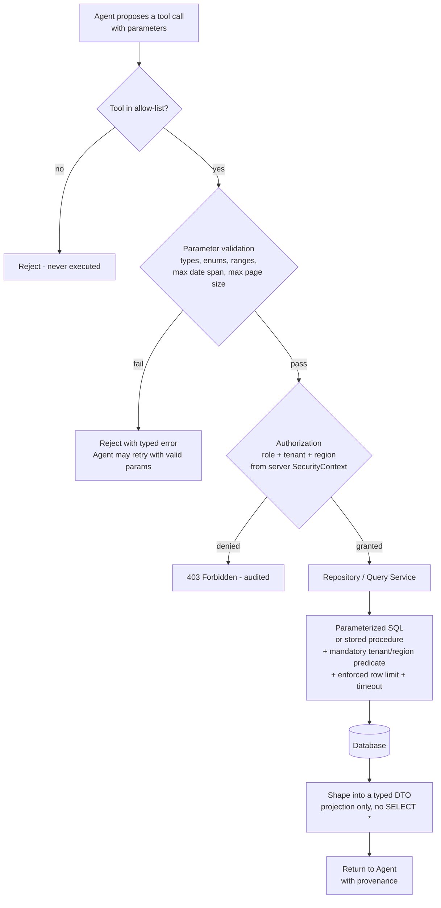

### 9.3 Threats Mitigated

| Threat                            | Mitigation                                                                                                                                                                                                                              |
| --------------------------------- | --------------------------------------------------------------------------------------------------------------------------------------------------------------------------------------------------------------------------------------- |
| **SQL injection**                 | The model never emits SQL. Every query is a parameterized statement or stored procedure with bound parameters. String concatenation is prohibited by design.                                                                            |
| **Invalid parameters**            | Strict schema validation: types, enum membership, non-null, date ordering, maximum range span. Rejected before reaching the data layer.                                                                                                 |
| **Unauthorized queries**          | The tool allow-list is intersected with the caller's role. A tool the user's role cannot invoke is not even visible to the Agent for that request.                                                                                      |
| **Excessive query ranges**        | Hard caps on date span, row count, page size, plus a server-side query timeout. Requests exceeding limits are converted into an async job (§11), never allowed to run unbounded.                                                        |
| **Cross-tenant access**           | `TenantId` is injected server-side from the validated token into **every** predicate and is never accepted as a caller-supplied parameter. Row-Level Security in the database is the second line of defence.                            |
| **Agent-hallucinated parameters** | A hallucinated column, metric or enum value fails schema validation and produces a typed error, not a query. Hallucinated _values_ (e.g. an unknown `vehicleId`) return an empty typed result the LLM is instructed to report honestly. |
| **Region escalation**             | A `region` parameter is always intersected with `AllowedRegions` from the token; it can only ever _narrow_ access, never widen it.                                                                                                      |
| **Resource exhaustion**           | Per-user and per-tenant rate limits, concurrency caps, and statement timeouts.                                                                                                                                                          |

**Defence in depth:** parameter validation, service-layer authorization, mandatory query predicates, and database Row-Level Security are four independent layers. A defect in any one does not create a breach.

---

## 10. Security

### 10.1 Three Distinct Questions

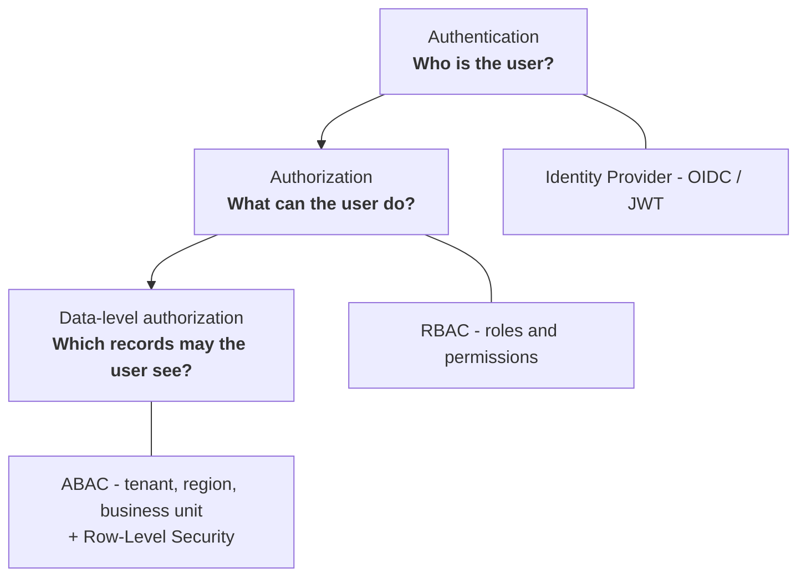

| Layer                    | Question                          | Enforced by                                                           | Failure result         |
| ------------------------ | --------------------------------- | --------------------------------------------------------------------- | ---------------------- |
| Authentication           | Who are you?                      | Identity Provider, token validation at the gateway                    | 401 Unauthorized       |
| Authorization            | What operations may you invoke?   | Backend API / tool allow-list (RBAC)                                  | 403 Forbidden          |
| Data-level authorization | Which rows/documents may you see? | Query Service predicates + RAG metadata filters + database RLS (ABAC) | Filtered result or 403 |

### 10.2 Token Claims as the Trust Anchor

Representative JWT claims:

| Claim            | Example           | Use                                                      |
| ---------------- | ----------------- | -------------------------------------------------------- |
| `UserId`         | `u-10482`         | Audit trail, per-user rate limiting, cache partitioning  |
| `Role`           | `RegionalManager` | RBAC — which tools are callable                          |
| `TenantId`       | `t-acme`          | Hard isolation boundary on every query and vector filter |
| `AllowedRegions` | `["USA"]`         | ABAC — the business/data regions the user may read       |
| `BusinessUnit`   | `Agriculture`     | Further ABAC narrowing                                   |

### 10.3 Worked Authorization Example

A user with `Role = RegionalManager` and `AllowedRegions = ["USA"]` asks:

> "Show Germany vehicle failures"

```mermaid
sequenceDiagram
    autonumber
    actor U as RegionalManager (USA)
    participant API as Backend API
    participant AG as Agent
    participant CQS as Controlled Query Service
    participant DB as Database

    U->>API: Show Germany vehicle failures
    API->>API: Build SecurityContext - AllowedRegions = USA
    API->>AG: Invoke with SecurityContext
    AG->>AG: Intent = structured query; region = Germany
    AG->>CQS: GetVehicleFailureCount region=Germany
    CQS->>CQS: Is Germany in AllowedRegions USA ?
    CQS-->>API: NO -> 403 Forbidden (audited)
    API-->>U: "You are not authorized to access data for Germany."
    Note over CQS,DB: The query is never sent to the database.
    Note over AG,CQS: The Agent asked. The trusted service refused.
```

The Agent behaved perfectly reasonably — the user did ask about Germany. **The Agent is not a security boundary; the Controlled Query Service is.**

### 10.4 The Central Security Invariant

> **The Agent may decide WHICH tool to call.
> The Agent must NEVER decide WHAT DATA the user is authorized to access.**

Because the Agent's behaviour is influenced by user-supplied natural language, it must be treated as a **semi-trusted component operating on untrusted input**. Prompt injection — whether typed by the user or embedded in an ingested document — could persuade it to _request_ anything. That is acceptable only because every request is independently re-authorised by trusted backend code using a `SecurityContext` derived from the validated token, which the Agent can neither read nor modify.

Practical consequences:

- Authorization is enforced in **backend services**, never in prompts, never in the client.
- `TenantId` and `AllowedRegions` flow **out-of-band** from the tool parameters.
- Retrieved document chunks are treated as **data, not instructions**, when placed in the prompt.
- Every authorization decision — grant and deny — is audit-logged with the correlation ID.

### 10.5 Access Control Models

| Model                      | Role here                                               | Example                                                                          |
| -------------------------- | ------------------------------------------------------- | -------------------------------------------------------------------------------- |
| **RBAC**                   | Coarse-grained: which tools/endpoints a role may invoke | `Technician` may call `GetMaintenanceHistory` but not `RunAnalytics`             |
| **ABAC**                   | Fine-grained: which records, based on attributes        | `Region ∈ AllowedRegions AND BusinessUnit = user.BusinessUnit`                   |
| **Tenant isolation**       | Absolute boundary; never overridable by any role        | `TenantId` predicate injected server-side on every query and vector filter       |
| **Region-level filtering** | Business/data-residency scoping                         | `WHERE Region IN (@allowedRegions)` and the equivalent Vector DB metadata filter |
| **Row-Level Security**     | Database-enforced backstop                              | RLS policy on session context — protects even against an application-layer bug   |

### 10.6 Platform Security Controls

| Control                   | Approach                                                                                                                           |
| ------------------------- | ---------------------------------------------------------------------------------------------------------------------------------- |
| **Secrets management**    | No secrets in code, config files or environment-baked images. Central secret store with managed identities and automatic rotation. |
| **Encryption in transit** | TLS 1.2+ everywhere, including service-to-service. Terminate at the gateway; re-encrypt internally.                                |
| **Encryption at rest**    | Storage, warehouse, vector store, queues, caches and backups all encrypted; customer-managed keys where regulation requires it.    |
| **Network isolation**     | Private endpoints for data stores; no public database exposure; egress controls on the LLM/embedding path.                         |
| **Gateway controls**      | WAF, rate limiting, request size limits, schema validation, token validation before any backend is touched.                        |
| **Least privilege**       | Each worker and service gets its own identity with the minimum permissions on the minimum resources.                               |
| **PII handling**          | Detect and mask PII before it is embedded or sent to an LLM; document what leaves the trust boundary.                              |
| **Auditing**              | Immutable audit log of every question, tool call, authorization decision and data access.                                          |

### 10.7 Deployment Region vs Business/Data-Access Region

These two ideas share a word and nothing else. Conflating them causes both security and compliance defects.

```mermaid
flowchart TB
    subgraph DEP["Cloud Deployment Region &nbsp;-&nbsp; INFRASTRUCTURE"]
        D1["Physical location where compute<br/>and storage are hosted"]
        D2["Examples: East US, West Europe,<br/>ap-southeast-1"]
        D3["Chosen for: latency, availability,<br/>DR, cost, data residency law"]
        D4["Configured by: Platform Engineering"]
        D5["Changes: rarely, via infrastructure"]
    end
    subgraph BIZ["Business / Data-Access Region &nbsp;-&nbsp; AUTHORIZATION"]
        B1["Business scope of a data record<br/>and of a user's permission"]
        B2["Examples: USA, Germany, APAC,<br/>North America Sales"]
        B3["Chosen for: org structure,<br/>ownership, access policy"]
        B4["Configured by: Identity & data governance"]
        B5["Changes: per user, per record"]
    end
    DEP -. "completely independent concerns" .-> BIZ
```

| Aspect        | Cloud Deployment Region               | Business / Data-Access Region                                      |
| ------------- | ------------------------------------- | ------------------------------------------------------------------ |
| Nature        | Infrastructure topology               | Data attribute + authorization claim                               |
| Lives in      | ARM/Terraform, resource configuration | Row column `Region`, chunk metadata `Region`, JWT `AllowedRegions` |
| Enforced by   | Cloud provider placement              | Query predicates, RAG metadata filters, RLS                        |
| Typical error | —                                     | Assuming "deployed in West Europe" means "only European data"      |

A concrete illustration: the platform may be **deployed in West Europe** while a user's `AllowedRegions = ["USA"]`. Those facts are unrelated. Deployment region does not filter a single row. Only the business-region predicate does.

Where data-residency regulation applies, the two are _linked by explicit policy_ — for example, EU-region records are stored in an EU-deployed data plane — but that is a deliberate governance decision, not an automatic consequence.

---

## 11. Long-Running Requests

### 11.1 The Problem

Some requests legitimately need to scan millions of records — fleet-wide reliability analysis, multi-year cohort comparisons, bulk report generation. Holding an HTTP request open for these means: gateway and load-balancer timeouts, a browser tab hostage to the backend, retries that duplicate expensive work, thread/connection exhaustion, and total loss of progress on any transient failure.

### 11.2 Asynchronous Job Pattern

```mermaid
sequenceDiagram
    autonumber
    actor U as User
    participant UI as Web UI
    participant API as Backend API
    participant Q as Job Queue
    participant W as Analytics Worker
    participant RS as Result Store
    participant BUS as Event Bus
    participant WS as Realtime Hub - WebSocket or SignalR

    U->>UI: Request fleet-wide analysis
    UI->>API: POST /jobs
    API->>API: Validate + authorize + estimate cost
    API->>Q: Enqueue job - JobId, params, SecurityContext snapshot
    API-->>UI: 202 Accepted with JobId and statusUrl
    UI-->>U: Job started + progress indicator
    W->>Q: Dequeue job
    W->>W: Process in partitions, checkpoint progress
    W-->>WS: Progress updates - 40 percent
    WS-->>UI: Live progress
    W->>RS: Persist result with JobId and expiry
    W->>BUS: Publish JobCompleted
    BUS->>WS: Notify subscribers
    WS-->>UI: JobCompleted for JobId
    UI->>API: GET job result by JobId
    API->>API: Re-authorize the requester
    API->>RS: Fetch result
    API-->>UI: Result payload
    UI-->>U: Render analysis
```

### 11.3 Flow Summary

```mermaid
flowchart LR
    UI["UI"] --> API["API: create job"] --> Q["Job Queue"] --> W["Analytics Worker"]
    W --> P["Process in partitions<br/>with checkpoints"] --> RS[("Result Store")]
    RS --> EV["JobCompleted event"] --> NT["SignalR / WebSocket /<br/>email notification"] --> UI2["UI displays result"]
```

### 11.4 Design Rules

| Rule                                                                             | Reason                                                                                                    |
| -------------------------------------------------------------------------------- | --------------------------------------------------------------------------------------------------------- |
| Return **202 Accepted** with a `JobId` immediately                               | Frees the request thread; the user gets instant feedback                                                  |
| Decide sync vs async by **estimated cost**, not by guesswork                     | Row-count/date-span estimation routes heavy work to the async path automatically                          |
| Support **polling _and_ push**                                                   | WebSocket/SignalR for live UX; polling as the resilient fallback                                          |
| **Snapshot the SecurityContext** at submission and **re-authorize at retrieval** | Prevents both privilege escalation mid-job and result leakage after a permission change                   |
| **Checkpoint progress**                                                          | A worker crash resumes rather than restarting from zero                                                   |
| **Idempotent job submission** via a client-supplied request key                  | A double-click must not launch two expensive jobs                                                         |
| **TTL and quota on results**                                                     | Result stores must not grow without bound; large results are delivered as signed, expiring download links |
| **Cancellation support**                                                         | Users must be able to stop a job they no longer need                                                      |

The Agent participates naturally: if the Analytics tool reports that a request exceeds the synchronous threshold, the Agent responds _"This analysis has been started; you'll be notified when it completes,"_ rather than blocking.

---

## 12. ML / Prediction Pipeline

Offline training and online inference are **separate systems with separate lifecycles**. Conflating them is a classic production failure.

### 12.1 Offline: Training (Batch, Scheduled, Human-Gated)

```mermaid
flowchart LR
    H["Historical Data<br/>warehouse + lake"] --> FE["Feature Engineering<br/>windows, aggregates, labels"]
    FE --> FS[("Feature Store<br/>versioned, point-in-time correct")]
    FS --> TR["Model Training<br/>experiments + hyperparameters"]
    TR --> VA["Validation<br/>hold-out metrics, bias & drift checks,<br/>champion vs challenger"]
    VA -- "fails gate" --> TR
    VA -- "passes gate" --> MR[("Model Registry<br/>version, metrics, lineage, approval")]
    MR --> DP["Deployment<br/>staged rollout / shadow / canary"]
    DP --> INF["ML Inference Service<br/>online endpoint"]
```

### 12.2 Online: Inference (Real-Time, Per Request)

```mermaid
flowchart TB
    AG["Agent"] --> PT["Prediction Tool<br/>PredictFailure(vehicleId, horizon)"]
    PT --> AZ["Validate + authorize<br/>may this user see this vehicle?"]
    AZ --> IS["ML Inference Service"]
    IS --> FL["Fetch features<br/>Feature Store + live telemetry"]
    FL --> MD["Model - registered version"]
    MD --> PR["Prediction<br/>probability + confidence<br/>+ top contributing factors"]
    PR --> LLM["LLM explanation<br/>plain-language interpretation<br/>of the model output"]
    LLM --> UI["UI<br/>prediction + drivers + caveats"]
    IS -. "log features, prediction,<br/>model version" .-> MON[("Monitoring / Drift Store")]
    MON -. "drift or decay detected" .-> RT["Trigger retraining"]
```

### 12.3 Separation of Concerns

|            | Offline Training                            | Online Inference              |
| ---------- | ------------------------------------------- | ----------------------------- |
| Trigger    | Schedule, drift alert, or new labelled data | A user question               |
| Latency    | Hours is fine                               | Milliseconds required         |
| Data       | Full history                                | One entity's current features |
| Compute    | Large, bursty, GPU-capable                  | Small, steady, always-on      |
| Output     | A registered, versioned model artefact      | A single prediction           |
| Governance | Human approval gate before promotion        | Automated, but fully logged   |

**The LLM explains the prediction; it does not make it.** The number comes from the model; the LLM turns the model's output and contributing factors into readable language. The model version is returned alongside the prediction so every answer is reproducible and auditable.

The **Feature Store** exists to guarantee that training and serving compute features identically — training/serving skew is otherwise the most common cause of a model that tests well and performs badly.

---

## 13. Caching

### 13.1 Cache Read Path

```mermaid
flowchart TB
    UI["UI"] --> API["Backend API"]
    API --> K["Build cache key<br/>TenantId + UserRole + AllowedRegions<br/>+ normalized query + params + schema version"]
    K --> C{"Cache lookup"}
    C -- "HIT" --> R1["Return immediately<br/>record cache-hit metric"]
    C -- "MISS" --> QS["Query Service / RAG / Analytics"]
    QS --> DB[("SQL / Vector DB")]
    DB --> ST["Store in cache with TTL"]
    ST --> R2["Return response"]
    R1 --> UI
    R2 --> UI
```

### 13.2 What to Cache — and What Not To

| Layer                                                    | Cache?       | TTL        | Notes                                                                     |
| -------------------------------------------------------- | ------------ | ---------- | ------------------------------------------------------------------------- |
| Reference/lookup data (models, regions, catalogues)      | Yes          | Long       | Rarely changes; very high hit rate                                        |
| Pre-computed analytics & dashboard aggregates            | Yes          | Medium     | The highest-value cache: expensive to compute, frequently requested       |
| Query-embedding vectors for repeated questions           | Yes          | Medium     | Avoids paying for identical embedding calls                               |
| Top-K retrieval results for identical query + filter set | Yes          | Short      | Must include the full authorization filter in the key                     |
| LLM responses for identical prompt + context             | Cautiously   | Short      | Only when context is byte-identical; store a hash, not raw sensitive text |
| ML predictions                                           | Short only   | Very short | Predictions decay as telemetry updates                                    |
| Per-user personalised or row-level results               | Generally no | —          | Risk outweighs benefit; if cached, the key **must** be user-scoped        |
| Session/rate-limit/idempotency state                     | Yes          | Bounded    | Operational state, not business data                                      |

### 13.3 Invalidation

| Strategy                      | When used                                                                                                          |
| ----------------------------- | ------------------------------------------------------------------------------------------------------------------ |
| **TTL expiry**                | Default for everything; simple and self-healing                                                                    |
| **Event-driven invalidation** | On `IngestionCompleted`, evict the affected aggregate keys — freshness where it matters                            |
| **Version-stamped keys**      | Include a dataset/schema version in the key; a version bump invalidates an entire generation atomically            |
| **Write-through**             | For small, hot, frequently-read reference data                                                                     |
| **Stampede protection**       | Single-flight locking plus jittered TTLs so a popular key expiring does not send a thundering herd to the database |

### 13.4 The Cardinal Rule

> **Never cache an authorized result under a key that omits the authorization context.**

Every cache key **must** include `TenantId`, the effective `AllowedRegions` and the role, or a USA manager will be served a cached answer computed for a Germany manager. This is the most common and most damaging caching bug in multi-tenant analytics systems.

Additional guards:

- Sensitive results are cached only in a **tenant-partitioned** namespace, encrypted at rest, with short TTLs.
- Cached data is **derived, never authoritative** — the system must be fully correct with the cache disabled. Cache failure degrades latency, never correctness (see §14).

---

## 14. Reliability

### 14.1 Resilience Patterns

```mermaid
flowchart TB
    C["Caller"] --> TO["Timeout<br/>bound every outbound call"]
    TO --> RT["Retry with<br/>exponential backoff + jitter<br/>transient errors only"]
    RT --> CB{"Circuit Breaker"}
    CB -- "closed" --> D["Dependency"]
    CB -- "open" --> FB["Fallback / graceful degradation"]
    CB -- "half-open" --> PROBE["Probe with limited traffic"]
    D -- "repeated failures" --> CB
    RT -- "attempts exhausted" --> DLQ[("Dead Letter Queue<br/>async paths only")]
    FB --> RESP["Partial but honest response"]
```

| Pattern                                     | Application in this system                                                                                                                                                                                                       |
| ------------------------------------------- | -------------------------------------------------------------------------------------------------------------------------------------------------------------------------------------------------------------------------------- |
| **Retry with exponential backoff + jitter** | Transient DB failovers, throttled LLM/embedding calls, blob read hiccups. Jitter prevents synchronised retry storms. **Only retry idempotent operations.**                                                                       |
| **Circuit breaker**                         | Wraps the LLM, embedding, Vector DB, ML and SQL clients. Stops hammering a dependency that is already failing and fails fast instead.                                                                                            |
| **Timeout**                                 | Every outbound call and every SQL statement. A request with no timeout is an outage waiting to happen. Client-side timeouts are strictly shorter than gateway timeouts.                                                          |
| **Bulkhead**                                | Separate connection pools and concurrency limits per dependency, so a slow Vector DB cannot exhaust the threads needed for SQL.                                                                                                  |
| **Dead Letter Queue**                       | Poison messages leave the main queue with full diagnostics; operators triage and replay after a fix.                                                                                                                             |
| **Idempotency**                             | Deterministic keys + upserts + processed-message store (see §4.3) make retries and duplicates harmless.                                                                                                                          |
| **Correlation ID**                          | Generated at the UI/gateway, propagated through every hop, queue message, log line and trace span.                                                                                                                               |
| **Health checks**                           | _Liveness_ (is the process alive?) and _readiness_ (are dependencies reachable?) kept separate — a failing readiness check removes an instance from rotation without killing it. Workers additionally expose backlog-age health. |
| **DB connection resiliency**                | Pooling, connection validation, retry-on-transient-fault providers, and read replicas for heavy analytical reads.                                                                                                                |

### 14.2 Graceful Degradation by Dependency

| Failing dependency    | Behaviour                                                                                                        | Result quality                      |
| --------------------- | ---------------------------------------------------------------------------------------------------------------- | ----------------------------------- |
| **Redis cache**       | Bypass the cache and query the source directly                                                                   | Slower, fully correct               |
| **Vector DB**         | Answer structured/analytics portions; clearly state that document knowledge is temporarily unavailable           | Partial, honest                     |
| **LLM provider**      | Fail over to a secondary model/region; if unavailable, return raw structured results in tables without narrative | Degraded presentation, correct data |
| **ML inference**      | Return historical trend data with an explicit "prediction unavailable" notice                                    | Partial                             |
| **SQL warehouse**     | Serve cached aggregates where valid; mark results as "as of \<timestamp\>"                                       | Stale but labelled                  |
| **Ingestion workers** | Messages accumulate durably in the queue; user queries are unaffected                                            | Only freshness is impacted          |

The consistent principle: **a partial answer that is clearly labelled beats either a fabricated answer or a blank error page.** The one thing the system must never do is silently present incomplete data as complete.

### 14.3 LLM-Specific Reliability

| Risk                                    | Mitigation                                                                                                                          |
| --------------------------------------- | ----------------------------------------------------------------------------------------------------------------------------------- |
| Rate limiting / quota exhaustion        | Token-bucket client-side throttling, request queuing, multi-region or multi-provider failover                                       |
| Latency spikes                          | Streaming responses, aggressive timeouts, cached responses for identical context                                                    |
| Non-deterministic output                | Low temperature for factual synthesis, strict output schemas, server-side validation of returned structures                         |
| Hallucination                           | Ground strictly in retrieved context; instruct the model to say "not found"; attach citations; never let the LLM originate a metric |
| Prompt injection via ingested documents | Treat retrieved chunks as data; enforce authorization outside the prompt; sanitise and delimit injected content                     |

---

## 15. Observability

### 15.1 The Three Pillars

| Pillar                  | Purpose                                           | Content                                                                                                                   |
| ----------------------- | ------------------------------------------------- | ------------------------------------------------------------------------------------------------------------------------- |
| **Logs**                | What happened, in detail                          | Structured JSON with `CorrelationId`, `TenantId`, `UserId`, tool name, outcome. **Never** log secrets, tokens or raw PII. |
| **Metrics**             | Aggregate health and trends                       | Counters, gauges, histograms — the basis for alerting and autoscaling                                                     |
| **Distributed tracing** | Causality and latency attribution across services | Spans linked by trace ID across HTTP hops _and_ queue boundaries                                                          |

### 15.2 End-to-End Trace with a Shared Correlation ID

```mermaid
flowchart TB
    UI["UI Request<br/>generates CorrelationId: abc-123"] --> API["Backend API<br/>span: api.handle - abc-123"]
    API --> AG["Agent<br/>span: agent.plan - abc-123"]
    AG --> T1["Tool: QueryStructuredData<br/>span: tool.sql - abc-123"]
    AG --> T2["Tool: SearchKnowledgeBase<br/>span: tool.rag - abc-123"]
    AG --> T3["Tool: PredictFailure<br/>span: tool.ml - abc-123"]
    T1 --> DB[("SQL<br/>span: db.query - abc-123")]
    T2 --> VDB[("Vector DB<br/>span: vector.search - abc-123")]
    T3 --> MLS["ML Service<br/>span: ml.infer - abc-123"]
    DB --> LLM["LLM<br/>span: llm.complete - abc-123"]
    VDB --> LLM
    MLS --> LLM
    LLM --> RESP["Response<br/>abc-123"]
```

The same correlation ID is also written into the queue message properties, so an asynchronous job's worker spans join the **same trace** as the originating user request. Without this, async debugging degrades into guesswork.

### 15.3 Signals to Instrument

**Live query path**

| Metric                                                          | Why                                                                  |
| --------------------------------------------------------------- | -------------------------------------------------------------------- |
| End-to-end request latency (p50/p95/p99)                        | The user-facing SLO                                                  |
| Intent classification distribution & confidence                 | Detects routing drift and misclassification                          |
| Tool invocation counts and error rates                          | Which capability is failing                                          |
| SQL query latency & rows scanned                                | Catches missing indexes and range-cap violations                     |
| Vector search latency & top-K relevance scores                  | Detects index degradation and poor recall                            |
| RAG retrieval latency and "no relevant chunks" rate             | Early signal of an indexing or chunking regression                   |
| LLM latency, error rate, retry rate                             | Provider health                                                      |
| **Token usage** — prompt/completion, per tenant and per feature | Cost control and abuse detection; the single most useful cost metric |
| Prediction latency & model version distribution                 | Confirms rollouts landed                                             |
| Cache hit ratio by cache type                                   | Justifies or retires each cache                                      |
| Authorization denials                                           | Security signal and UX signal                                        |

**Ingestion path**

| Metric                                                | Why                                                                |
| ----------------------------------------------------- | ------------------------------------------------------------------ |
| **Queue depth and backlog age**                       | Primary autoscaling trigger; backlog _age_ matters more than depth |
| Worker processing duration per stage                  | Locates the true bottleneck                                        |
| Worker failure rate and retry counts                  | Health of the pipeline                                             |
| **DLQ message count**                                 | Should alert on _any_ sustained growth                             |
| Documents chunked / embeddings generated per minute   | Throughput trend                                                   |
| Embedding API throttling rate                         | Explains slow indexing                                             |
| Ingestion end-to-end freshness lag (lake → queryable) | The real business SLA for data freshness                           |

**Platform**

Application health (liveness/readiness), CPU/memory/connection-pool saturation, dependency availability, error budget burn.

### 15.4 Alerting Philosophy

Alert on **symptoms users feel** (p95 latency breach, error-rate spike, freshness lag beyond SLA, DLQ growth), not on every internal fluctuation. Dashboards answer "what is happening"; traces answer "why"; logs answer "exactly what". All three are joined by the correlation ID.

---

## 16. Scalability

### 16.1 Independent Scaling Units

Every component scales independently because each has a different bottleneck and a different cost curve. Coupling them wastes money and creates artificial ceilings.

```mermaid
flowchart TB
    subgraph SYNC["Request Path - scales on traffic"]
        A1["Backend API<br/>CPU + request rate"]
        A2["RAG Service<br/>search latency + RPS"]
        A3["ML Inference Service<br/>RPS + inference latency"]
        A4["Analytics Service<br/>concurrency"]
    end
    subgraph ASYNC["Ingestion Path - scales on backlog"]
        B1["Structured ETL Workers<br/>queue depth"]
        B2["Document Workers<br/>queue depth"]
        B3["Embedding Workers<br/>queue depth + API rate limit"]
        B4["Analytics Job Workers<br/>job queue depth"]
    end
    subgraph DATA["Data Tier - scales by design"]
        C1[("SQL: read replicas,<br/>partitioning, elastic pools")]
        C2[("Vector DB: shards + replicas")]
        C3[("Redis: clustered")]
        C4[("Data Lake: effectively unbounded")]
    end
    SYNC --> DATA
    ASYNC --> DATA
```

### 16.2 Autoscaling Triggers

| Component              | Primary trigger           | Secondary                      | Notes                                                   |
| ---------------------- | ------------------------- | ------------------------------ | ------------------------------------------------------- |
| Backend API            | Requests per second       | CPU, p95 latency               | Stateless; scales fast                                  |
| RAG Service            | RPS                       | Search latency                 | Bounded by Vector DB capacity                           |
| Embedding Workers      | Queue depth               | Embedding API rate limit       | **Scale-out ceiling is the model's quota, not the CPU** |
| Document Workers       | Queue depth + backlog age | CPU (parsing/OCR is CPU-bound) | Memory-heavy for large PDFs                             |
| Structured ETL Workers | Queue depth               | DB write throughput            | Ceiling is the warehouse, not the workers               |
| Analytics Job Workers  | Job queue depth           | Job wait time                  | Scale to zero when idle                                 |
| ML Inference           | RPS                       | p95 inference latency          | GPU-backed pools where warranted                        |

### 16.3 Scaling Principles

| Principle                              | Detail                                                                                                                                                                 |
| -------------------------------------- | ---------------------------------------------------------------------------------------------------------------------------------------------------------------------- |
| **Stateless services**                 | No in-process session state; all state lives in Redis, the DB or the message. This is what makes horizontal scaling safe.                                              |
| **Backlog age over queue depth**       | Depth alone is misleading — 10,000 fast messages are healthier than 100 slow ones. Age reflects the real SLA.                                                          |
| **Scale to zero for bursty workloads** | Analytics job workers cost nothing between jobs.                                                                                                                       |
| **Respect downstream ceilings**        | Scaling embedding workers past the model's quota just converts success into throttling errors. Every autoscale rule needs a maximum derived from the downstream limit. |
| **Partition for parallelism**          | Partition by `VehicleId`/`TenantId` so ordering is preserved per entity while remaining parallel across entities.                                                      |
| **Separate read and write paths**      | Read replicas and pre-aggregated tables for analytics; the ingestion write path stays isolated from user reads.                                                        |
| **Cost-aware scaling**                 | LLM and embedding calls are usage-priced. Cache, batch and short-circuit unchanged content — the cheapest call is the one never made.                                  |

---

## 17. Example End-to-End Request

> **"Which vehicle model had the highest failure rate in the US last month, and what are the common reasons mentioned in maintenance reports?"**

This single sentence contains two fundamentally different questions: a **precise numerical ranking** and a **semantic summary of narrative text**. Neither retrieval mode alone can answer it.

### 17.1 Decomposition

```mermaid
flowchart TB
    U["User question"] --> AG["Agent / Orchestrator"]
    AG --> DEC{"Decompose"}
    DEC --> T1["Task 1 - Structured<br/>'highest failure rate in US last month'"]
    DEC --> T2["Task 2 - Knowledge<br/>'common reasons in maintenance reports'"]

    T1 --> CQS["Controlled Query Service<br/>GetTopFailureModels(region='US', period='last month')"]
    CQS --> AZ1["Authorize: 'US' in AllowedRegions - OK"]
    AZ1 --> SQL[("SQL / Warehouse<br/>parameterized, tenant + region filtered")]
    SQL --> R1["Result: Model-X = 12.4% failure rate"]

    R1 --> T2
    T2 --> RAG["RAG Service<br/>SearchKnowledgeBase(query, filters)"]
    RAG --> FIL["Metadata filter:<br/>DocumentType = MaintenanceReport,<br/>Model = Model-X, Region = US,<br/>Timestamp = last month,<br/>TenantId from SecurityContext"]
    FIL --> VDB[("Vector DB<br/>similarity search")]
    VDB --> R2["Top-K chunks:<br/>cooling-system failures,<br/>temperature-sensor faults"]

    R1 --> MERGE["Merge: structured result<br/>+ retrieved context<br/>+ citations"]
    R2 --> MERGE
    MERGE --> LLM["LLM<br/>compose grounded answer<br/>using ONLY supplied context"]
    LLM --> API["Backend API<br/>validate, redact, attach sources"]
    API --> UI["Web UI<br/>answer + 12.4% + cited reports"]
```

Note the **dependency**: Task 2 is filtered by Model-X, which is only known _after_ Task 1 completes. The Agent sequences dependent tasks and parallelises independent ones.

### 17.2 Timeline

```mermaid
sequenceDiagram
    autonumber
    actor U as User
    participant API as Backend API
    participant AG as Agent
    participant CQS as Controlled Query Service
    participant SQL as SQL Warehouse
    participant RAG as RAG Service
    participant VDB as Vector DB
    participant LLM as LLM

    U->>API: Question with Bearer token and CorrelationId abc-123
    API->>API: Authenticate + build SecurityContext<br/>TenantId and AllowedRegions = USA
    API->>AG: Invoke with question and SecurityContext
    AG->>AG: Intent = MIXED -> plan is structured then knowledge

    rect rgb(235, 245, 255)
    Note over AG,SQL: Task 1 - exact numbers
    AG->>CQS: GetTopFailureModels region=US period=last month
    CQS->>CQS: Validate params; US in AllowedRegions -> allowed
    CQS->>SQL: Parameterized query + tenant/region predicate
    SQL-->>CQS: Model-X, failureRate = 12.4%
    CQS-->>AG: Typed result + row provenance
    end

    rect rgb(240, 255, 240)
    Note over AG,VDB: Task 2 - semantic reasons filtered by Task 1 output
    AG->>RAG: SearchKnowledgeBase - failure reasons for Model-X + filters
    RAG->>RAG: Embed query; build metadata filter from SecurityContext
    RAG->>VDB: Filtered vector similarity search
    VDB-->>RAG: Top-K chunks + SourceUri
    RAG-->>AG: Ranked chunks + citations
    end

    AG->>LLM: Structured result + retrieved context + grounding instructions
    LLM-->>AG: "Model-X had the highest failure rate at 12.4%...<br/>reports cite cooling-system and temperature-sensor issues."
    AG-->>API: Answer + data + citations
    API->>API: Validate, redact, audit-log
    API-->>U: Grounded answer with sources and drill-down
```

### 17.3 Why This Composition Is Correct

| Aspect                                         | Source                                     | Guarantee                                                      |
| ---------------------------------------------- | ------------------------------------------ | -------------------------------------------------------------- |
| **12.4%**                                      | SQL aggregate over the warehouse           | Exact, reproducible, auditable — never generated by the LLM    |
| **Model-X**                                    | SQL ranking                                | Deterministic                                                  |
| **Cooling-system / temperature-sensor issues** | RAG over maintenance reports               | Cited to specific documents the user is authorised to see      |
| **The narrative**                              | LLM                                        | Language only; no new facts introduced                         |
| **Region scope**                               | `SecurityContext` from the validated token | Enforced in both SQL predicates and Vector DB metadata filters |

**The LLM contributes language, not truth.** Every fact in the response is traceable to either a database row or a cited document chunk — which is exactly what makes the answer defensible to a business user, an auditor, and a regulator.

---

## 18. Component Responsibility Table

| Component                         | Responsibility                                                                                         | Why It Is Needed                                                                                                       |
| --------------------------------- | ------------------------------------------------------------------------------------------------------ | ---------------------------------------------------------------------------------------------------------------------- |
| **Web UI**                        | Capture questions, render answers, citations, charts and job progress                                  | Single entry point for users; deliberately holds **no** routing or authorization logic because the client is untrusted |
| **API Gateway**                   | TLS termination, routing, rate limiting, WAF, request validation, token validation                     | One hardened, consistent edge; protects backends from abuse and hides internal topology                                |
| **Backend API**                   | Orchestrate the request, build the trusted `SecurityContext`, apply caching, shape and audit responses | The trust boundary and the only place business/authorization rules are enforced for the request                        |
| **Identity Provider**             | Authenticate users, issue tokens with `Role`, `TenantId`, `AllowedRegions`                             | Centralised identity with SSO/MFA; the trust anchor for every authorization decision                                   |
| **AI Agent / Orchestrator**       | Detect intent, select and sequence tools, decompose compound questions, merge results                  | Removes routing decisions from the UI and lets new capabilities ship without a UI change                               |
| **Controlled Query Service**      | Expose strongly typed, validated, authorized data operations over parameterized SQL                    | Gives the LLM data access **without** giving it database access — the core data-security control                       |
| **RAG Service**                   | Embed queries, apply metadata/authorization filters, retrieve and re-rank chunks                       | Makes unstructured knowledge searchable and grounds LLM answers in citable sources                                     |
| **Event Bus**                     | Broadcast domain events to many independent subscribers                                                | Loose coupling: new consumers subscribe with zero producer changes                                                     |
| **Message Broker**                | Host queues/topics with durability, ordering, retry and acknowledgement                                | Guarantees no work is lost between services                                                                            |
| **Queue**                         | Buffer work items for competing consumers                                                              | Load levelling, backpressure and horizontal scaling for bursty volumes                                                 |
| **Worker Service**                | Consume messages and perform validation, transformation, chunking, embedding and persistence           | Moves heavy processing off the request path and scales independently                                                   |
| **SQL Database / Data Warehouse** | Store modelled structured data; serve exact aggregations and joins                                     | Deterministic, auditable numbers — something an LLM cannot guarantee                                                   |
| **Vector Database**               | Store embeddings, chunk text, metadata and source references; serve similarity search                  | Semantic retrieval over unstructured content with authorization-aware filtering                                        |
| **Data Lake / Object Storage**    | Immutable landing zone and system of record for raw data and original documents                        | Cheap durable storage; enables full replay/reprocessing of every derived index                                         |
| **Redis / Distributed Cache**     | Cache hot reference data, aggregates, embeddings and session/idempotency state                         | Cuts latency and expensive recomputation; also the coordination substrate for idempotency and rate limiting            |
| **ML Service**                    | Train, validate, register and serve predictive models                                                  | Produces genuine predictions; an LLM cannot forecast from telemetry                                                    |
| **LLM**                           | Interpret intent, structure, summarise and explain retrieved information                               | Natural-language interface — used for **language**, never as a source of truth                                         |
| **Dead Letter Queue**             | Quarantine messages that exhausted retries, with diagnostics                                           | Prevents poison messages from blocking the pipeline; preserves them for triage and replay                              |
| **Job Result Store**              | Persist async job outputs with TTL and access control                                                  | Decouples long-running computation from the HTTP request lifecycle                                                     |
| **Monitoring / Observability**    | Collect logs, metrics and traces correlated end to end                                                 | Makes a distributed, event-driven system diagnosable and operable                                                      |

---

## 19. Technology Mapping

Vendor choices are **implementation detail** — the architecture holds regardless of provider. The following is one concrete, well-supported realisation.

### 19.1 Example .NET / Azure Implementation

| Layer                      | Technology                                              | Rationale                                                                                                                                  |
| -------------------------- | ------------------------------------------------------- | ------------------------------------------------------------------------------------------------------------------------------------------ |
| **Frontend**               | React or Angular (TypeScript)                           | Mature SPA ecosystem, strong charting/streaming support                                                                                    |
| **Backend API**            | ASP.NET Core Web API                                    | High performance, first-class DI/middleware, native OpenTelemetry support                                                                  |
| **Workers**                | .NET Worker Service (`BackgroundService`) in containers | Purpose-built hosted-service model with graceful shutdown and health checks                                                                |
| **API Gateway**            | Azure API Management                                    | Centralised auth, rate limiting, policy, versioning, developer portal                                                                      |
| **Identity**               | Microsoft Entra ID                                      | Enterprise SSO, MFA, conditional access, managed identities, app roles                                                                     |
| **Events**                 | Azure Event Grid                                        | Serverless pub/sub fan-out; native Blob-created events from the lake                                                                       |
| **Queue / Messaging**      | Azure Service Bus                                       | Queues + topics, sessions for ordering, built-in DLQ, at-least-once delivery                                                               |
| **Data Lake**              | Azure Data Lake Storage Gen2                            | Hierarchical namespace, lifecycle tiering, POSIX-style ACLs                                                                                |
| **Structured Storage**     | Azure SQL Database / Azure Synapse                      | Azure SQL for operational queries; Synapse for large-scale analytical workloads                                                            |
| **Vector Search**          | Azure AI Search **or** PostgreSQL + `pgvector`          | AI Search for managed hybrid + semantic ranking; pgvector when co-locating vectors with relational data reduces operational surface        |
| **LLM / Embeddings**       | Azure OpenAI                                            | Enterprise data-handling commitments, private networking, regional deployment                                                              |
| **ML**                     | Azure Machine Learning                                  | Managed training, model registry, versioned online endpoints                                                                               |
| **Cache**                  | Azure Cache for Redis                                   | Distributed cache, idempotency store, rate-limit counters                                                                                  |
| **Realtime notifications** | Azure SignalR Service                                   | Push job progress/completion without client polling                                                                                        |
| **Observability**          | Application Insights + OpenTelemetry                    | Vendor-neutral instrumentation with end-to-end distributed tracing                                                                         |
| **Containerization**       | Docker                                                  | Reproducible builds; identical artefacts across environments                                                                               |
| **Orchestration**          | Azure Container Apps → AKS **only where justified**     | Container Apps covers most needs with KEDA queue-depth scaling and scale-to-zero; adopt AKS only when its complexity is genuinely required |
| **IaC / CI-CD**            | Bicep or Terraform + GitHub Actions / Azure DevOps      | Reproducible, reviewable infrastructure and deployments                                                                                    |

### 19.2 AWS Equivalents

| Capability            | Azure                 | AWS                                   |
| --------------------- | --------------------- | ------------------------------------- |
| API Gateway           | API Management        | API Gateway                           |
| Identity              | Entra ID              | Cognito / IAM Identity Center         |
| Event Bus             | Event Grid            | EventBridge / SNS                     |
| Queue                 | Service Bus           | SQS (+ SNS for fan-out)               |
| Data Lake             | ADLS Gen2             | S3                                    |
| Warehouse             | Synapse / Azure SQL   | Redshift / RDS / Athena               |
| Vector Search         | AI Search / pgvector  | OpenSearch / Aurora pgvector / Kendra |
| LLM & Embeddings      | Azure OpenAI          | Amazon Bedrock                        |
| ML Platform           | Azure ML              | SageMaker                             |
| Cache                 | Azure Cache for Redis | ElastiCache                           |
| Serverless containers | Container Apps        | ECS Fargate / App Runner              |
| Kubernetes            | AKS                   | EKS                                   |
| Observability         | App Insights          | CloudWatch + X-Ray + OpenTelemetry    |
| Secrets               | Key Vault             | Secrets Manager / Parameter Store     |

### 19.3 Staying Portable

Because every managed service sits behind an application-level abstraction — `IEventPublisher`, `IMessageConsumer`, `IVectorStore`, `IEmbeddingProvider`, `ILlmClient`, `IJobStore` — the architecture is portable by construction. Combined with Docker and OpenTelemetry, changing a provider is an adapter change, not a redesign. This abstraction is deliberately **thin**: it exists to preserve optionality and testability, not to build a bespoke cloud-abstraction framework.

---

## 20. Design Decisions / Trade-Offs

Every decision below states the alternative that was rejected and the cost that was accepted. An architecture without acknowledged trade-offs is not an architecture.

| #   | Decision                                                 | Alternative rejected                                                 | Why                                                                                                                                                                                | Cost accepted                                                                                                 |
| --- | -------------------------------------------------------- | -------------------------------------------------------------------- | ---------------------------------------------------------------------------------------------------------------------------------------------------------------------------------- | ------------------------------------------------------------------------------------------------------------- |
| 1   | **Event-driven ingestion**                               | Scheduled polling of the Data Lake                                   | Polling cost grows with lake size, adds latency up to the poll interval, and forces expensive "what's new?" scans. Events carry the exact object identity at near-zero idle cost.  | Requires idempotency and duplicate handling; a reconciliation sweep is retained as a safety net               |
| 2   | **Queue between events and workers**                     | Direct invocation per event                                          | A burst of a million events would overwhelm workers and the database. Queues give buffering, backpressure, retry, DLQ and competing-consumers scaling.                             | Eventual consistency; a queue is another component to operate                                                 |
| 3   | **Dedicated Worker Services**                            | Doing heavy processing inside the API                                | Chunking and embedding are minutes-scale; running them in a request handler destroys API latency and couples two completely different scaling profiles.                            | More deployable units; needs its own observability                                                            |
| 4   | **SQL/warehouse for structured data**                    | Storing everything as vectors                                        | Aggregations, joins and time-series ranking must be exact, cheap and auditable. Vector search cannot count.                                                                        | Requires schema modelling and ETL discipline                                                                  |
| 5   | **Vector DB for semantic search**                        | Keyword search over documents                                        | Users ask conceptually ("engine running hot") while documents say "thermal overload". Embeddings match meaning, not tokens.                                                        | Index must be rebuilt when the embedding model changes                                                        |
| 6   | **RAG instead of fine-tuning or context stuffing**       | Fine-tuning on corporate documents; or loading the lake into context | RAG updates instantly as documents change, supports per-user authorization filtering, and provides citations. Fine-tuning bakes in stale data and cannot enforce row-level access. | Retrieval quality becomes a first-class engineering concern                                                   |
| 7   | **Agent for orchestration**                              | Routing rules in the UI or a rigid backend `switch`                  | Natural language is open-ended; the Agent decomposes compound questions and adapts as tools are added, with **zero UI changes**.                                                   | Non-determinism; needs evaluation harnesses, guardrails and monitoring of routing accuracy                    |
| 8   | **Dedicated ML service**                                 | Asking the LLM to predict                                            | LLMs do not learn from telemetry and cannot produce calibrated probabilities. Real prediction needs engineered features, training, validation and versioning.                      | Full MLOps lifecycle to build and maintain                                                                    |
| 9   | **Controlled tools, never direct DB access for the LLM** | Text-to-SQL against the live warehouse                               | Generated SQL is unbounded and unpredictable: injection risk, cross-tenant exposure, runaway scans, hallucinated schema. Typed tools give a small, auditable, testable surface.    | Less flexibility — new questions may need a new tool; accepted deliberately as the security/reliability trade |
| 10  | **Async jobs for long-running work**                     | Holding the HTTP request open                                        | Gateway timeouts, wasted resources, duplicate work on retry and total progress loss. `202 Accepted` + notification is resilient and gives better UX.                               | Job lifecycle, result store, notification channel and cancellation to implement                               |
| 11  | **Redis for hot data**                                   | Recomputing every request                                            | Dashboard aggregates and reference lookups are read constantly and change slowly; caching removes both latency and cost.                                                           | Invalidation complexity; strict discipline on authorization-scoped keys                                       |
| 12  | **Separate business region from deployment region**      | Treating them as one                                                 | Conflation causes both over-exposure (assuming deployment implies filtering) and under-serving (assuming one region per data plane). They are unrelated concerns.                  | Two concepts to explain and govern                                                                            |
| 13  | **Managed services over self-hosting**                   | Self-managed Kafka/Kubernetes everywhere                             | Managed queues, search and model hosting remove undifferentiated operational load. AKS is adopted only where genuinely justified.                                                  | Some vendor coupling — mitigated by thin abstractions                                                         |

### 20.1 Explicit Non-Goals

Stating what the design deliberately does **not** do is as important as stating what it does:

- **No autonomous write actions by the Agent.** It reads and explains; it does not mutate business data.
- **No free-form SQL generation** by the LLM, in any form, at any privilege level.
- **No fine-tuning on proprietary documents** — RAG covers the requirement with better freshness, citations and access control.
- **No streaming-first (Kafka-style) architecture** unless sub-second ingestion latency becomes a real requirement; event + queue is sufficient and simpler today.
- **No microservice-per-entity decomposition.** Services are split by _scaling profile and failure domain_, not by data model.
- **No custom cloud-abstraction framework** beyond the thin interfaces already described.

---

## 21. Interview Summary

### 21.1 60-Second Architecture Explanation

> The platform has **two independent pipelines**.
>
> **First, data preparation.** Vehicle, machine, telemetry and business data lands in a **Data Lake**. Each arrival raises a **NewDataAvailable event** published to an **Event Bus**, which places work on a **Queue**. **Worker Services** consume that queue and validate, clean, transform and enrich the data, then split it by type. Structured data is modelled and loaded into a **SQL Data Warehouse**. Unstructured documents are text-extracted, **chunked**, **embedded**, tagged with metadata such as region, tenant, document type and version, and stored in a **Vector Database** — while the original document stays in the lake, so every index is rebuildable. The queue gives buffering, retry and a dead-letter path, and idempotent upserts make duplicate delivery harmless.
>
> **Second, the live request path.** A user asks a question in the **Web UI**. It goes through an **API Gateway** which handles TLS, rate limiting and **token validation**, then to the **Backend API**, which builds a trusted **SecurityContext** from the token's claims — user, role, tenant and allowed regions. The Backend invokes the **AI Agent/Orchestrator**, which performs **intent detection and tool selection** — the UI never decides this. The Agent calls approved, strongly typed tools: the **Controlled Query Service** for exact numbers over SQL, the **RAG Service** for semantic retrieval from the Vector DB, the **ML Inference Service** for predictions, and the **Analytics Service** for heavy computation — or several of them for a mixed question. Results are merged and handed to the **LLM**, which **structures, summarises and explains** — grounded strictly in the retrieved context, with citations. The Backend validates and audits the answer and returns it to the UI.
>
> **Three rules hold the design together.** The Agent decides _which tool_; trusted backend services decide _what data_ — authorization is never delegated to the model. The LLM never touches a database directly; it only calls validated, parameterised, authorised operations. And anything long-running becomes an **asynchronous job** — 202 Accepted, queue, worker, result store, completion event, push notification — so no HTTP request is ever held open. Every hop carries the same **correlation ID**, so one trace spans UI → API → Agent → tool → data store, across both synchronous and queued work.

### 21.2 Key Architecture Principles

| Principle                    | How it is realised here                                                                                                           |
| ---------------------------- | --------------------------------------------------------------------------------------------------------------------------------- |
| **Loose coupling**           | Event Bus and queues: producers never reference consumers; new subscribers need no producer change                                |
| **Separation of concerns**   | Ingestion vs serving; orchestration vs data access; training vs inference; language vs truth                                      |
| **Event-driven processing**  | Work is triggered by facts, not by timers scanning storage                                                                        |
| **Horizontal scalability**   | Stateless services and workers scaling independently on their own signals — RPS for APIs, backlog age for workers                 |
| **Security by design**       | Authentication at the edge, RBAC at the tool boundary, ABAC and RLS at the row, encryption everywhere, least privilege throughout |
| **Data-level authorization** | Tenant and region predicates injected server-side into every SQL query and every vector metadata filter                           |
| **Resilience**               | Timeouts, retries with backoff and jitter, circuit breakers, bulkheads, DLQs and honest graceful degradation                      |
| **Observability**            | Logs, metrics and distributed traces joined by a correlation ID that survives queue boundaries                                    |
| **Idempotency**              | Deterministic keys, upserts and a processed-message store make at-least-once delivery safe                                        |
| **Grounded AI responses**    | Every fact comes from a database row or a cited document chunk; the LLM supplies language, never truth                            |

### 21.3 The Three Sentences That Matter Most

1. **"The Agent decides which tool to call; it never decides what data the user is allowed to see."** — the security invariant.
2. **"The LLM gets controlled, typed tools — never a database connection."** — the data-access invariant.
3. **"Ingestion is event-and-queue driven and asynchronous; serving is synchronous and reads only pre-computed indexes."** — the performance invariant.

---

## Appendix A — Consistency Check

Verified across the document; no contradictory data flows remain.

| Check                                                                                                                              | Result                          |
| ---------------------------------------------------------------------------------------------------------------------------------- | ------------------------------- |
| Ingestion is the only writer to serving stores; the live path only reads                                                           | Consistent (§1.1, §2, §6)       |
| The Data Lake remains the system of record; SQL and Vector DB are derived and rebuildable                                          | Consistent (§2.5, §20 #1)       |
| The UI never routes; the Agent always routes                                                                                       | Consistent (§1.1, §6.1, §7.1)   |
| The LLM never issues SQL and never holds credentials                                                                               | Consistent (§7.1, §9.1, §9.2)   |
| Authorization is enforced only in trusted backend services, using a server-built `SecurityContext`                                 | Consistent (§9.2, §10.4, §17.2) |
| Region filtering is applied identically to SQL predicates and Vector DB metadata filters                                           | Consistent (§2.4, §8.2, §10.3)  |
| Long-running work never blocks HTTP; it always becomes a job                                                                       | Consistent (§7.2, §11, §16.2)   |
| Cache keys always include tenant, role and allowed regions                                                                         | Consistent (§13.1, §13.4)       |
| Correlation ID propagates across HTTP **and** queue boundaries                                                                     | Consistent (§14.1, §15.2)       |
| Exact metrics come from SQL; semantic content comes from RAG; predictions come from the ML service; the LLM only composes language | Consistent (§8.4, §12.3, §17.3) |
| Deployment region and business/data-access region are never conflated                                                              | Consistent (§10.7)              |

---

_End of document._
