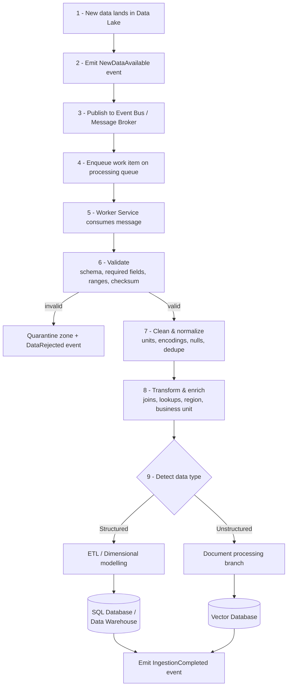
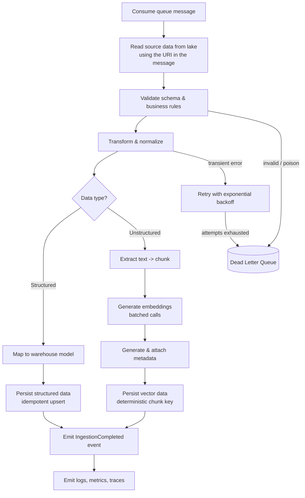
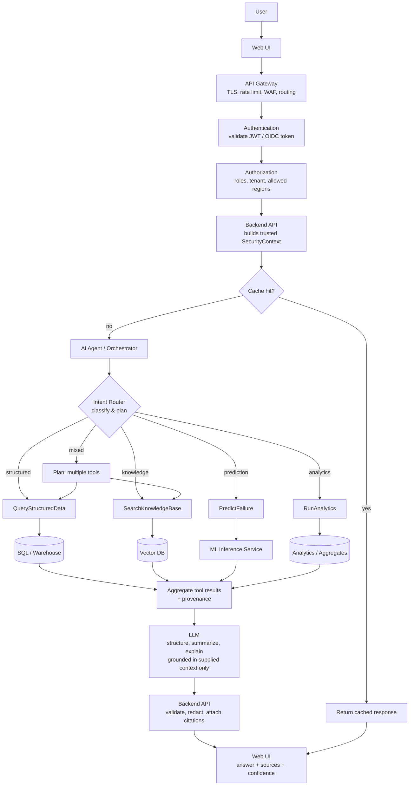
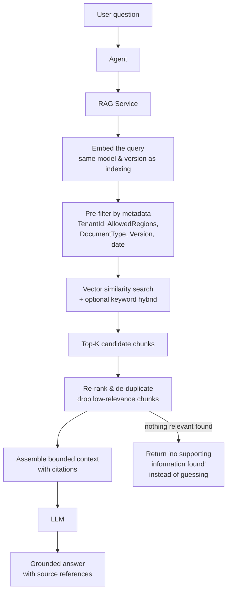

# Intelligent Telemetry & Knowledge Platform — Architecture

**Document type:** Solution Architecture (condensed)
**Audience:** Solution Architects / .NET Architects

---

## The Whole Flow in 5 Lines

1. **Data Lake → Event → Queue → Worker:** Whenever new data arrives, an event triggers scalable Worker Services to validate, clean, transform, and process it.
2. **Worker → SQL / Vector DB:** Structured data goes to SQL/Data Warehouse; unstructured data is chunked, embedded with metadata, and stored in the Vector DB.
3. **UI → API Gateway → Auth → AI Agent:** User questions reach the Agent/Orchestrator, which identifies the intent and required data source.
4. **Agent → SQL / RAG / ML:** Structured queries use controlled SQL tools, document questions use RAG + Vector DB, and predictions use the ML service; mixed queries can use multiple tools.
5. **Results → LLM → UI:** Retrieved results are combined and passed to the LLM to structure, summarize, and generate a grounded response for the user.

> **Two invariants:** the Agent decides _which tool_ to call but never _what data_ the user may see; and the LLM gets typed, authorized tools — never a database connection.

---

## Index

| #   | Section                                               | Stage          |
| --- | ----------------------------------------------------- | -------------- |
| 1   | [Ingestion Workflow](#1-ingestion-workflow)           | Ingestion time |
| 2   | [Worker Responsibilities](#2-worker-responsibilities) | Ingestion time |
| 3   | [Live Request Flow](#3-live-request-flow)             | Query time     |
| 4   | [RAG Retrieval](#4-rag-retrieval)                     | Query time     |

Sections 1–2 run **once per file, asynchronously**. Sections 3–4 run **once per question, synchronously**, and read only what 1–2 have already prepared.

---

## 1. Ingestion Workflow

What happens when new data arrives in the Data Lake. Work is triggered by an **event**, buffered by a **queue**, and executed by **workers** — never by polling the lake.

The original document always stays in the Data Lake. The SQL Warehouse and Vector DB are **derived indexes**, so a bad chunking or embedding decision is fixed by replaying — not by a data-loss incident.

---

## 2. Worker Responsibilities

What a single worker does with one message, including how it fails safely.

Key points:

- **Idempotent writes.** Deterministic keys and upserts make at-least-once delivery harmless — duplicates are expected, not prevented.
- **Retry then DLQ.** Transient failures back off and retry; poison messages are quarantined so one bad file cannot block the queue.
- **Stateless and horizontally scaled**, with queue depth and backlog age as the autoscaling signal.

---

## 3. Live Request Flow

What happens per user question. Routing is decided **server-side by the Agent**, never in the browser.

Exact metrics come from **SQL**; semantic content comes from **RAG**; predictions come from the **ML service**. The LLM contributes language, never a number of its own. Anything too large for a synchronous response becomes an async job — `202 Accepted`, queue, worker, notification.

---

## 4. RAG Retrieval

How a document question is answered. The mirror of ingestion: indexing ran once per document, retrieval runs once per question.

Two details that are easy to get wrong:

- The query must be embedded with the **same model and version used for indexing**, so a model upgrade forces a re-index.
- **Metadata filtering is applied before ranking** and is derived from the server-side `SecurityContext` — never from the user's text or the Agent's output. Filtering afterwards would let unauthorised content reach the LLM.
